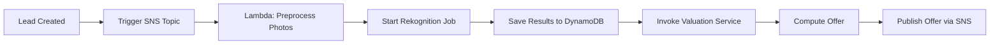

**app\_flow\.md**

---

## 1. Overview

This document outlines user flows, API contract sketches, and event-driven sequences for QuicklyClose’s seller and investor experiences.

---

## 2. User Flow Diagrams

### 2.1. Seller Journey

1. **Landing Page** →
2. **Address Capture Form** (POST /api/sellers/leads) →
3. **Property Details Form** (PUT /api/sellers/leads/{leadId}/details) →
4. **Photo Upload** (POST /api/sellers/leads/{leadId}/photos) →
5. **Processing State** (GET /api/sellers/leads/{leadId}/status) →
6. **Offer Notification** (SMS/Email via SNS) →
7. **Offer Acceptance** (POST /api/sellers/leads/{leadId}/accept)

### 2.2. Investor Journey

1. **Login / Registration** (POST /api/investors/signup, POST /api/investors/login) →
2. **Profile Setup** (POST /api/investors/{invId}/profile) →
3. **Property Feed** (GET /api/properties?filters...) →
4. **Comp Vision Trigger** (POST /api/properties/{propId}/analyze-photo) →
5. **Display Comps** (GET /api/properties/{propId}/comps) →
6. **Place Bid** (POST /api/properties/{propId}/bids) →
7. **Bid Status Updates** (Websocket /api/investors/{invId}/bids/stream)

---

## 3. API Contract Sketches

### 3.1. Seller Lead Intake

**POST /api/sellers/leads**

```json
{
  "address": "123 Main St, City, State, ZIP",
  "phone": "+15551234567"
}
```

**Response:** 201 Created

```json
{ "leadId": "uuid-v4" }
```

**PUT /api/sellers/leads/{leadId}/details**

```json
{
  "beds": 3,
  "baths": 2,
  "sqft": 1500,
  "yearBuilt": 1985,
  "condition": "fair",
  "motivation": "inherited"
}
```

**POST /api/sellers/leads/{leadId}/photos** (multipart/form-data)

---

### 3.2. Investor Actions

**GET /api/properties** Query params: `market=NYC&minPrice=100000&maxPrice=300000`

**POST /api/properties/{propId}/analyze-photo**

```json
{ "photoUrl": "https://s3.../photo.jpg" }
```

**Response:** 202 Accepted

```json
{ "analysisId": "uuid-v4" }
```

**GET /api/properties/{propId}/comps?analysisId=uuid-v4**

```json
{
  "comps": [
    { "id": "c1", "price": 250000, "similarity": 0.92, "imageUrl": "..." },
    { "id": "c2", "price": 260000, "similarity": 0.89, "imageUrl": "..." },
    { "id": "c3", "price": 245000, "similarity": 0.87, "imageUrl": "..." }
  ]
}
```

**POST /api/properties/{propId}/bids**

```json
{
  "investorId": "uuid-v4",
  "offerPrice": 240000,
  "earnest": 5000,
  "terms": { "inspectionDays": 3 }
}
```

---

## 4. Event-Driven Sequences

### 4.1. Lead Processing Workflow



### 4.2. Bid Lifecycle

```mermaid
graph LR
  I[Bid Placed] --> J[Store Bid in PostgreSQL]
  J --> K[Notify Admin (SNS)]
  K --> L[Notify Investor (Websocket)]
  L --> M[Evaluate Bids & Determine Winner]
  M --> N[Notify Winner/Losers]
```

---

---

## 6. Future Phases (Phase 6)

| Phase                  | Weeks | Deliverables              | Owners |
| ---------------------- | ----- | ------------------------- | ------ |
| **Comp Scraper Agent** | 13–16 | - Flexmls API integration |        |

- Scheduled crawler & parser
- HTML/JSON scraper modules
- Elasticsearch ingestion pipeline
- Rate-limiting & monitoring setup | BE, DevOps, MLE |

---

*Prepared by: CTO, QuicklyClose*

