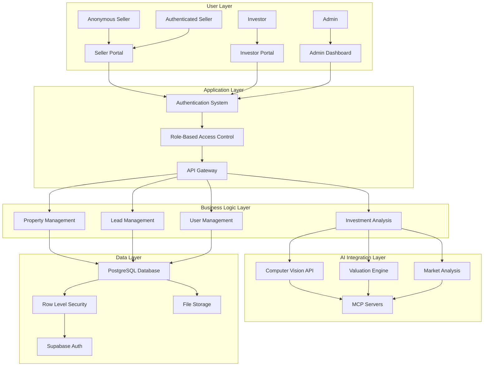
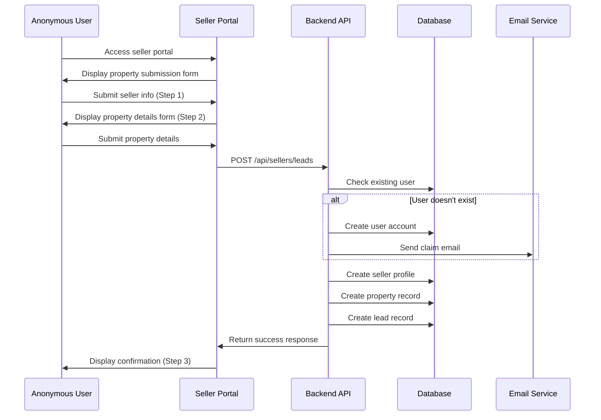
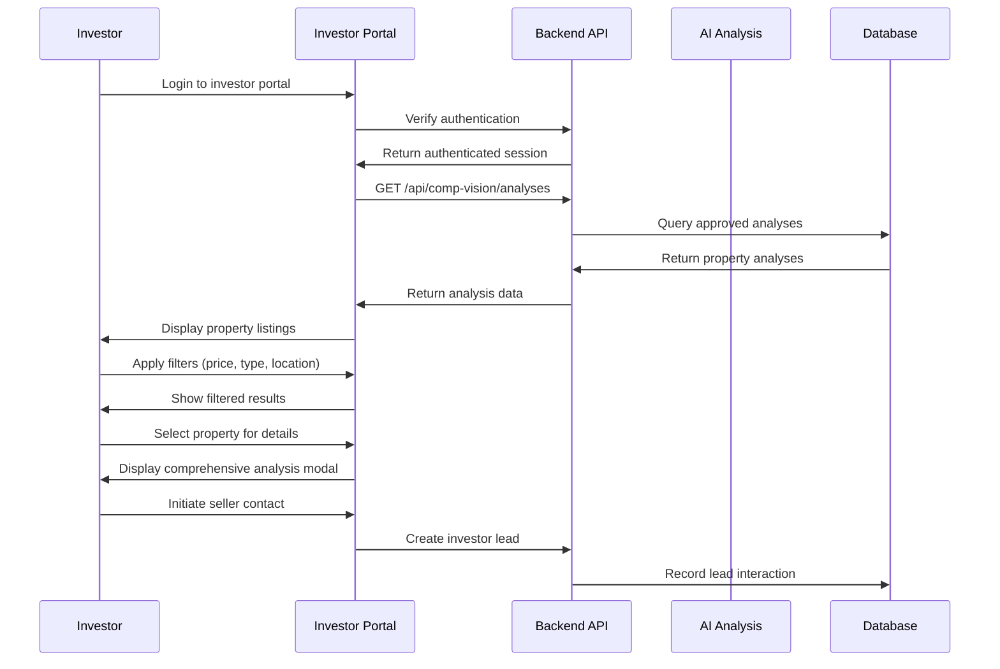
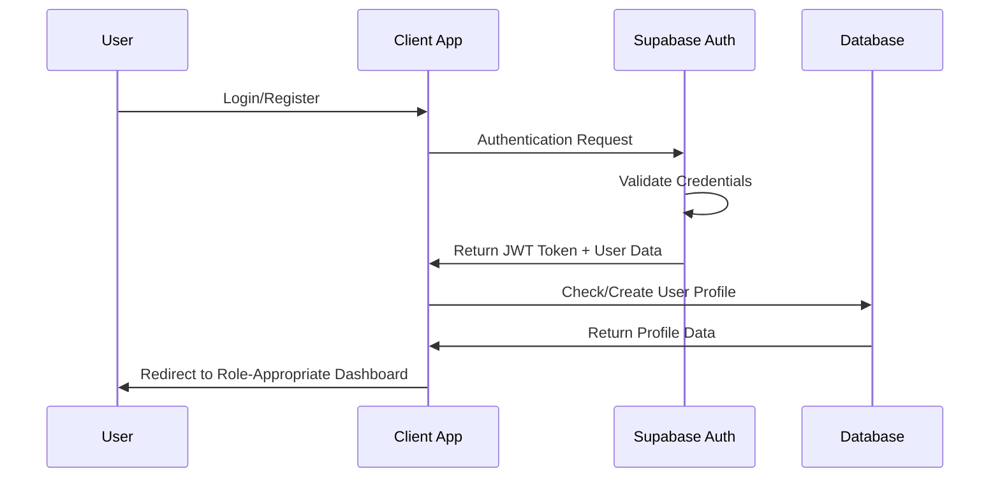

# QuicklyClose Platform - Detailed Functional Requirements Documentation

## Table of Contents
1. [Executive Summary](#executive-summary)
2. [Document Scope & Purpose](#document-scope--purpose)
3. [User Personas & Business Context](#user-personas--business-context)
4. [System Architecture Overview](#system-architecture-overview)
5. [Seller Portal Functional Requirements](#seller-portal-functional-requirements)
6. [Investor Portal Functional Requirements](#investor-portal-functional-requirements)
7. [Authentication & Authorization Requirements](#authentication--authorization-requirements)
8. [User Interface & Experience Requirements](#user-interface--experience-requirements)
9. [Business Logic & Validation Requirements](#business-logic--validation-requirements)
10. [Integration & API Requirements](#integration--api-requirements)
11. [Performance & Technical Requirements](#performance--technical-requirements)
12. [User Scenarios & Edge Cases](#user-scenarios--edge-cases)
13. [Acceptance Criteria Matrix](#acceptance-criteria-matrix)
14. [Future Enhancement Roadmap](#future-enhancement-roadmap)

---

## Executive Summary

QuicklyClose is a sophisticated AI-powered real estate platform that facilitates efficient connections between property sellers and real estate investors. This functional requirements document details the comprehensive seller and investor logic implemented in the current build, providing a foundation for understanding, maintaining, and extending the platform's capabilities.

### Key Platform Differentiators
- **Hybrid Anonymous/Authenticated Workflows**: Supports both anonymous property submissions and authenticated user management
- **AI-Powered Property Analysis**: Advanced computer vision and market analysis capabilities
- **Role-Based Access Control**: Sophisticated multi-role authentication and authorization system
- **Investment-Focused Analytics**: Comprehensive investment metrics for both fix-and-flip and rental strategies

---

## Document Scope & Purpose

### 🎯 **Document Purpose**
This document serves as the definitive functional specification for the QuicklyClose platform, focusing specifically on seller and investor workflows. It provides:

- **Development Teams**: Detailed implementation requirements and acceptance criteria
- **Product Managers**: Business logic documentation and user story validation
- **QA Teams**: Comprehensive testing scenarios and edge cases
- **Stakeholders**: Complete understanding of platform capabilities and limitations

### 📋 **Scope Coverage**
- Seller portal functionality and business logic
- Investor portal features and investment analysis
- Authentication and authorization mechanisms  
- User interface and experience requirements
- API integrations and data management
- Performance and technical specifications

### 🚫 **Out of Scope**
- Infrastructure and deployment specifications
- Third-party service integrations (beyond current implementation)
- Marketing and business development features
- Administrative backend functions (beyond basic admin portal)

---

## User Personas & Business Context

### 👤 **Primary Persona: Sarah Thompson - Property Seller**

**Demographics & Background**:
- Age: 42, Homeowner for 12 years
- Situation: Divorced, relocating for job opportunity
- Tech Comfort: Moderate, uses smartphone and basic web applications
- Timeline: Needs to sell house within 60 days
- Financial Goal: Quick cash sale to avoid foreclosure and relocation stress

**Motivations & Goals**:
- Get accurate property valuation without realtor involvement
- Avoid lengthy traditional listing process
- Receive multiple cash offers for comparison
- Close transaction quickly with minimal hassle
- Maintain privacy during personal transition

**Pain Points & Challenges**:
- Limited knowledge of current property values
- Previous bad experience with traditional real estate agent
- Time constraints due to job relocation timeline
- Concerns about investor legitimacy and fair offers
- Emotional stress of leaving family home

**Technology Usage Patterns**:
- Primarily uses mobile phone for web browsing
- Comfortable with simple forms and photo uploads
- Prefers clear, step-by-step processes
- Values immediate feedback and confirmation
- Needs progress indicators and status updates

**Success Criteria**:
- Property listed and analyzed within 24 hours
- Receives at least 2 qualified cash offers within 1 week
- Able to communicate directly with serious buyers
- Closing completed within 30 days of accepting offer

### 👤 **Primary Persona: Michael Chen - Real Estate Investor**

**Demographics & Background**:
- Age: 35, Full-time real estate investor
- Experience: 8 years, owns 23 rental properties
- Investment Strategy: Both fix-and-flip and buy-and-hold rentals
- Geographic Focus: Metropolitan areas in Texas and Arizona
- Annual Deal Volume: 15-20 properties purchased per year

**Motivations & Goals**:
- Efficiently identify undervalued properties
- Access comprehensive investment analysis quickly
- Reduce time spent on market research and due diligence
- Build relationships with motivated sellers
- Scale investment portfolio systematically

**Pain Points & Challenges**:
- Time-intensive property analysis process
- Competition with other investors for deals
- Difficulty accessing pre-market opportunities
- Inconsistent lead quality from marketing efforts
- Need for faster decision-making tools

**Technology Usage Patterns**:
- Uses desktop and mobile devices interchangeably
- Comfortable with complex data and analytical tools
- Values detailed metrics and comparative analysis
- Expects professional-grade functionality
- Integrates tools into existing investment workflow

**Success Criteria**:
- Reviews 50+ properties per week efficiently
- Identifies 5-10 potential deals per month
- Completes investment analysis within 15 minutes per property
- Maintains deal pipeline of 20+ active opportunities
- Achieves target ROI on 80% of completed investments

### 👤 **Secondary Persona: Jennifer Rodriguez - Platform Administrator**

**Demographics & Background**:
- Age: 29, Technology and real estate background
- Role: Platform operations and quality control
- Responsibilities: AI analysis monitoring, user support, data quality
- Experience: 3 years in PropTech, former real estate analyst

**Daily Responsibilities**:
- Monitor AI analysis accuracy and flag anomalies
- Review and approve property analyses for public display
- Support users with technical issues and questions
- Maintain data quality and platform performance
- Generate reports for business stakeholders

---

## System Architecture Overview

### 🏗️ **High-Level Architecture**



### 🔄 **Core Business Workflows**

#### Seller Journey Flow


#### Investor Discovery Flow


---

## Seller Portal Functional Requirements

### 🏠 **FR-S001: Anonymous Property Submission**

**Priority**: Critical  
**User Story**: As an anonymous property owner, I want to submit my property details without creating an account so that I can quickly get an evaluation and connect with investors.

#### **Functional Specification**

**Step 1: Seller Information Collection**
- **Required Fields**: Full name, email address, phone number
- **Validation Rules**:
  - Name: Minimum 2 characters, maximum 50 characters, letters and spaces only
  - Email: Valid email format, maximum 100 characters, uniqueness check
  - Phone: Valid phone format, minimum 10 digits, maximum 15 digits
- **UI Requirements**:
  - Single-column form layout on mobile, two-column on desktop
  - Real-time validation with inline error messages
  - Progress indicator showing Step 1 of 3
  - Continue button disabled until all fields valid

**Step 2: Property Details Collection**  
- **Required Fields**: Address, city, state, ZIP code, bedrooms, bathrooms, square footage
- **Validation Rules**:
  - Address: Minimum 5 characters, maximum 100 characters
  - City: Minimum 2 characters, maximum 50 characters, letters and spaces only
  - State: 2-character state code, dropdown selection
  - ZIP: 5-digit ZIP code format validation
  - Bedrooms: Integer between 1 and 10
  - Bathrooms: Number with 0.5 increments, between 1 and 10
  - Square Footage: Integer between 500 and 50,000
- **UI Requirements**:
  - Responsive grid layout for optimal form presentation
  - Dropdown for state selection with all US states
  - Number inputs with appropriate min/max constraints
  - Back button to return to Step 1 with data preservation

**Step 3: Confirmation and Success**
- **Success Indicators**: Checkmark icon, confirmation message, reference number
- **Information Provided**: Submission confirmation, next steps, contact information
- **Actions Available**: Submit another property, create account to track submissions

#### **Backend Processing Requirements**

**Account Creation Logic**:
```typescript
interface AccountCreationFlow {
  1: "Check if user exists by email address";
  2: "If new user, create Supabase auth account with temporary password";
  3: "Set user metadata with full name and 'seller' role";  
  4: "Send password reset email for account claiming";
  5: "Create seller profile record linked to auth user";
  6: "Create property record linked to seller profile";
  7: "Create lead record for investor matching";
  8: "Return success response with lead ID";
}
```

**Data Persistence**:
- **seller_profiles table**: user_id, full_name, email, phone, preferred_communication, marketing_consent
- **properties table**: seller_id, address, city, state, zip_code, bedrooms, bathrooms, square_feet, status
- **leads table**: seller_id, property_id, status, lead_source, contact_method, created_at

#### **Acceptance Criteria**

✅ **AC-S001-1**: Anonymous user can access seller portal without authentication  
✅ **AC-S001-2**: Form validates all required fields with appropriate error messages  
✅ **AC-S001-3**: User can navigate between steps with data preservation  
✅ **AC-S001-4**: Successful submission creates user account, seller profile, property, and lead records  
✅ **AC-S001-5**: User receives email with account claim instructions  
✅ **AC-S001-6**: Success page displays confirmation with next steps  
✅ **AC-S001-7**: Process completes within 10 seconds under normal conditions  

### 🏠 **FR-S002: Authenticated Seller Dashboard**

**Priority**: High  
**User Story**: As a registered seller, I want to view and manage all my submitted properties so that I can track their status and manage investor interest.

#### **Functional Specification**

**Dashboard Overview**:
- **Header Section**: Welcome message, user name, total properties count
- **Action Bar**: "Sell Another Property" button, filter/sort options
- **Property Grid**: Card-based layout showing all user's properties
- **Empty State**: Friendly message and call-to-action when no properties exist

**Property Card Display**:
- **Property Image**: Placeholder or uploaded property photo
- **Basic Information**: Address, city, state, ZIP code
- **Property Metrics**: Bedrooms, bathrooms, square footage
- **Financial Information**: Estimated value (if available)
- **Status Badge**: Visual indicator of property status
- **Submission Date**: When property was originally submitted
- **Action Buttons**: View details, edit property, contact management

**Status Management**:
```typescript
type PropertyStatus = 
  | 'new'           // Recently submitted, awaiting review
  | 'under_review'  // Being analyzed by AI system  
  | 'active'        // Available to investors with completed analysis
  | 'in_negotiation'// Investor discussions ongoing
  | 'pending'       // Sale agreement reached, awaiting closing
  | 'sold'          // Transaction completed
  | 'expired'       // Listing expired or withdrawn
```

**Dashboard Features**:
- **Property Filtering**: Filter by status, submission date, estimated value
- **Property Sorting**: Sort by date, value, status, address
- **Bulk Actions**: Mark multiple properties for status updates
- **Analytics Summary**: Total properties, average estimated value, active leads

#### **Navigation and State Management**

**Dashboard Toggle Logic**:
```typescript
interface DashboardState {
  showForm: boolean;           // Toggle between dashboard and form
  selectedProperty: string;    // Currently selected property ID
  filterOptions: FilterState;  // Current filter settings
  sortOptions: SortState;      // Current sort settings
}
```

**State Transitions**:
- **Dashboard → Form**: Click "Sell Another Property" or "Submit First Property"
- **Form → Dashboard**: Click "Back to Dashboard" or complete submission
- **Dashboard → Property Details**: Click property card or "View Details"
- **Property Details → Dashboard**: Click back button or close modal

#### **Acceptance Criteria**

✅ **AC-S002-1**: Dashboard displays all properties belonging to authenticated seller  
✅ **AC-S002-2**: Property cards show accurate information and status  
✅ **AC-S002-3**: User can toggle between dashboard and form views  
✅ **AC-S002-4**: Empty state provides clear guidance for first-time users  
✅ **AC-S002-5**: Property status updates reflect in real-time  
✅ **AC-S002-6**: Dashboard loads within 3 seconds with proper loading states  

### 🏠 **FR-S003: Property Management Interface**

**Priority**: Medium  
**User Story**: As a seller, I want to update my property information and manage investor inquiries so that I can maintain accurate listings and respond to opportunities.

#### **Functional Specification**

**Property Editing Capabilities**:
- **Basic Information Updates**: Address corrections, description additions
- **Property Features**: Additional amenities, recent improvements, condition notes
- **Contact Preferences**: Preferred communication method, availability schedule
- **Pricing Information**: Minimum acceptable offer, timeline flexibility

**Inquiry Management**:
- **Investor Interest Tracking**: List of investors who expressed interest
- **Communication History**: Message thread with each interested investor
- **Lead Status Updates**: Mark leads as contacted, qualified, negotiating, closed
- **Response Templates**: Pre-written responses for common inquiries

#### **Acceptance Criteria**

✅ **AC-S003-1**: Seller can update property description and features  
✅ **AC-S003-2**: Changes are saved immediately with confirmation feedback  
✅ **AC-S003-3**: Seller can view all investor inquiries for each property  
✅ **AC-S003-4**: Communication system maintains message history  

---

## Investor Portal Functional Requirements

### 💼 **FR-I001: Authenticated Investor Access**

**Priority**: Critical  
**User Story**: As a real estate investor, I want secure access to the investor portal so that I can browse properties and access investment analysis tools.

#### **Functional Specification**

**Authentication Requirements**:
- **Role Verification**: User must have 'investor' role in user metadata
- **Session Management**: Persistent login session across browser sessions
- **Access Control**: Redirect non-investors to appropriate error page with role switching option
- **Profile Validation**: Ensure investor profile exists and is complete

**Role-Based Access Control**:
```typescript
interface InvestorAccessControl {
  requiredRole: 'investor';
  permissions: [
    'view_property_listings',
    'access_investment_analysis', 
    'contact_sellers',
    'manage_investor_profile',
    'view_demo_properties'
  ];
  restrictions: [
    'cannot_submit_properties',
    'cannot_access_seller_dashboard',
    'cannot_access_admin_functions'
  ];
}
```

**Profile Requirements**:
- **Investment Preferences**: Focus areas, investment amounts, preferred locations
- **Contact Information**: Professional details, company information
- **Communication Settings**: Preferred contact methods, notification preferences

#### **Acceptance Criteria**

✅ **AC-I001-1**: Only users with 'investor' role can access investor portal  
✅ **AC-I001-2**: Non-investors receive clear error message with role switching option  
✅ **AC-I001-3**: Session persists across browser sessions without re-authentication  
✅ **AC-I001-4**: Investor profile is created automatically upon first login  
✅ **AC-I001-5**: Access control prevents unauthorized actions  

### 💼 **FR-I002: Property Discovery and Filtering**

**Priority**: Critical  
**User Story**: As an investor, I want to browse and filter available properties so that I can quickly identify investment opportunities that match my criteria.

#### **Functional Specification**

**Property Browsing Interface**:
- **Grid Layout**: Responsive grid (1 col mobile, 2 tablet, 3+ desktop)
- **Property Cards**: Comprehensive information display with visual hierarchy
- **Loading States**: Skeleton loading during data fetch and filtering
- **Infinite Scroll**: Load additional properties as user scrolls (future enhancement)

**Filtering System**:
```typescript
interface PropertyFilters {
  priceRange: 'all' | 'under-300k' | '300k-500k' | '500k-750k' | '750k+';
  investmentType: 'all' | 'flip' | 'rental';
  location: 'all' | string; // Dynamic city options from available properties
}
```

**Filter Implementation**:
- **Price Range Filtering**: 
  - Under $300K: `estimated_value < 300000`
  - $300K-$500K: `estimated_value >= 300000 && estimated_value < 500000`  
  - $500K-$750K: `estimated_value >= 500000 && estimated_value < 750000`
  - $750K+: `estimated_value >= 750000`

- **Investment Type Filtering**:
  - Fix & Flip: Properties with `flip_comps` data available
  - Rental: Properties with `rental_comps` data available
  - All: No investment type restriction

- **Location Filtering**:
  - Dynamic city list generated from available properties
  - Exact city match filtering
  - Case-insensitive string matching

**Property Card Information**:
- **Property Image**: Optimized Next.js Image component with fallback
- **Address**: Full property address with city, state
- **Investment Metrics**: Estimated value, confidence score, potential ROI
- **Property Details**: Bedrooms, bathrooms, square footage
- **Investment Type Badges**: Visual indicators for flip/rental suitability
- **Analysis Date**: When AI analysis was performed

#### **Demo Mode Integration**

**Demo Mode Features**:
- **Toggle Control**: Clear toggle between live and demo data
- **Demo Data Set**: 5 comprehensive sample properties with full analysis
- **Realistic Scenarios**: Properties from different markets and price ranges
- **Educational Value**: Showcase different investment strategies and outcomes

**Demo Properties**:
1. **Atlanta Flip Opportunity**: Distressed property with high ARV potential
2. **Phoenix Rental**: Turnkey rental in growing suburban market  
3. **Buffalo Value Play**: Affordable property with strong cash flow
4. **San Diego Premium**: High-value coastal property for experienced investors
5. **Nashville Growth Market**: Emerging market with appreciation potential

#### **Acceptance Criteria**

✅ **AC-I002-1**: Properties display in responsive grid layout with proper loading states  
✅ **AC-I002-2**: All three filter types work independently and in combination  
✅ **AC-I002-3**: Filter application is instantaneous without page reload  
✅ **AC-I002-4**: Demo mode toggle works seamlessly with all filtering functionality  
✅ **AC-I002-5**: Property cards display accurate and complete information  
✅ **AC-I002-6**: No results state provides clear messaging and filter reset option  

### 💼 **FR-I003: Comprehensive Investment Analysis**

**Priority**: Critical  
**User Story**: As an investor, I want detailed investment analysis for each property so that I can make informed investment decisions quickly.

#### **Functional Specification**

**Analysis Modal Interface**:
- **Full-Screen Modal**: Immersive analysis experience with comprehensive data
- **Property Images**: High-resolution property photos with zoom capability
- **Tabbed Navigation**: Organized sections for different analysis types
- **Print/Export Options**: Generate PDF reports for offline review (future enhancement)

**Computer Vision Analysis**:
```typescript
interface ComputerVisionAnalysis {
  propertyFeatures: {
    feature: string;
    confidence: number; // 0-100 confidence score
    category: 'interior' | 'exterior' | 'structural' | 'amenity';
  }[];
  conditionAssessment: {
    overallScore: number; // 0-100 condition rating
    repairNeeds: string[];
    estimatedRepairCost: number;
  };
  marketPosition: {
    curbAppeal: number; // 0-100 curb appeal score
    neighborhoodQuality: number;
    marketingPotential: number;
  };
}
```

**Fix & Flip Analysis**:
```typescript
interface FlipAnalysis {
  afterRepairValue: number;      // ARV estimate
  purchasePrice: number;         // Current asking/estimated price  
  repairCosts: number;           // Estimated renovation costs
  holdingCosts: number;          // Monthly carrying costs
  sellingCosts: number;          // Realtor fees, closing costs
  potentialProfit: number;       // Total profit projection
  returnOnInvestment: number;    // ROI percentage
  projectTimeline: number;       // Estimated months to completion
  marketMetrics: {
    averageDaysOnMarket: number;
    saleToListRatio: number;
    marketTrend: 'rising' | 'stable' | 'declining';
    competitionLevel: 'low' | 'medium' | 'high';
  };
}
```

**Rental Property Analysis**:
```typescript
interface RentalAnalysis {
  marketRentEstimate: number;    // Monthly rent projection
  grossRentMultiplier: number;   // GRM calculation
  capRate: number;               // Capitalization rate
  cashOnCashReturn: number;      // Cash-on-cash return percentage
  monthlyExpenses: {
    propertyTaxes: number;
    insurance: number;
    propertyManagement: number;
    maintenanceReserve: number;
    vacancy: number;
    total: number;
  };
  netOperatingIncome: number;    // Annual NOI
  monthlyCashFlow: number;       // Monthly cash flow after expenses
  areaMetrics: {
    rentGrowthRate: number;      // Historical rent appreciation
    vacancyRate: number;         // Local vacancy percentage
    schoolRating: number;        // School district rating
    crimeScore: number;          // Area safety score
    transitAccess: number;       // Public transportation score
  };
}
```

**Comparative Market Analysis**:
- **Similar Properties**: 3-5 comparable properties with similarity scores
- **Property Comparisons**: Side-by-side comparison of key metrics
- **Market Context**: Neighborhood trends and price appreciation data
- **Investment Opportunity Ranking**: Relative scoring against other available properties

#### **Analysis Accuracy and Confidence**

**Confidence Scoring System**:
- **High Confidence (80-100%)**: Complete data available, recent comparables, clear market trends
- **Medium Confidence (60-79%)**: Good data availability, some market uncertainty
- **Low Confidence (40-59%)**: Limited data, volatile market conditions, unique property features
- **Insufficient Data (<40%)**: Not enough information for reliable analysis

**Data Quality Indicators**:
- **Analysis Date**: When the analysis was performed
- **Data Sources**: MLS data, public records, market reports
- **Last Updated**: When underlying data was last refreshed
- **Analyst Notes**: Professional commentary on analysis limitations or special considerations

#### **Acceptance Criteria**

✅ **AC-I003-1**: Analysis modal displays comprehensive property information and metrics  
✅ **AC-I003-2**: Both flip and rental analyses are accurate and well-formatted  
✅ **AC-I003-3**: Confidence scores are clearly displayed with explanatory tooltips  
✅ **AC-I003-4**: Similar properties comparison provides relevant and useful data  
✅ **AC-I003-5**: Analysis loads within 5 seconds with proper loading states  
✅ **AC-I003-6**: All financial calculations are mathematically correct and consistent  

### 💼 **FR-I004: Lead Generation and Seller Contact**

**Priority**: High  
**User Story**: As an investor, I want to express interest in properties and contact sellers so that I can pursue investment opportunities.

#### **Functional Specification**

**Interest Expression**:
- **Contact Seller Button**: Prominent call-to-action on property cards and analysis modal
- **Interest Level Selection**: High, medium, or general inquiry
- **Contact Preference**: Phone, email, or platform messaging
- **Timeline Indication**: When investor plans to make decisions/offers

**Lead Creation Process**:
```typescript
interface InvestorLead {
  investorId: string;
  propertyId: string;
  sellerId: string;
  interestLevel: 'high' | 'medium' | 'general';
  contactMethod: 'phone' | 'email' | 'platform';
  timeline: 'immediate' | '1-week' | '2-weeks' | 'month' | 'flexible';
  message: string; // Optional custom message
  status: 'new' | 'contacted' | 'responded' | 'qualified' | 'closed';
  createdAt: Date;
}
```

**Contact Management**:
- **Lead Tracking Dashboard**: View all expressed interests and their status
- **Communication History**: Record of all interactions with sellers
- **Follow-up Reminders**: Automated reminders for lead follow-up
- **Conversion Tracking**: Monitor leads through to deal completion

#### **Acceptance Criteria**

✅ **AC-I004-1**: Investor can express interest in properties with appropriate information collection  
✅ **AC-I004-2**: Lead records are created accurately in the database  
✅ **AC-I004-3**: Seller receives notification of investor interest  
✅ **AC-I004-4**: Investor can track all leads from their dashboard  
✅ **AC-I004-5**: Communication system maintains proper privacy and security  

---

## Authentication & Authorization Requirements

### 🔐 **FR-A001: Multi-Role Authentication System**

**Priority**: Critical  
**User Story**: As a platform user, I want secure role-based authentication so that I can access features appropriate to my user type while maintaining data security.

#### **Functional Specification**

**User Role Definitions**:
```typescript
type UserRole = 'seller' | 'investor' | 'admin';

interface UserMetadata {
  full_name: string;
  role: UserRole;
  profile_complete: boolean;
  created_at: string;
  last_login: string;
}
```

**Role-Based Access Matrix**:
| Feature | Seller | Investor | Admin |
|---------|--------|----------|-------|
| Submit Properties | ✅ | ❌ | ✅ |
| View Property Listings | Limited | ✅ | ✅ |
| Access Investment Analysis | ❌ | ✅ | ✅ |
| Manage Computer Vision | ❌ | ❌ | ✅ |
| User Administration | ❌ | ❌ | ✅ |
| View All Leads | Own Only | Own Only | ✅ |

**Authentication Flow**:


**Session Management**:
- **Token Persistence**: JWT tokens stored securely with automatic refresh
- **Session Timeout**: 24-hour session duration with sliding expiration
- **Multi-Device Support**: Users can be logged in on multiple devices
- **Secure Logout**: Complete session termination and token invalidation

#### **Account Creation Workflows**

**Manual Registration**:
1. User selects role during registration (seller/investor)
2. Email verification required before account activation
3. Role-appropriate profile created via database triggers
4. Welcome email sent with platform overview
5. User redirected to role-specific onboarding

**Automatic Account Creation (Sellers)**:
1. Anonymous property submission triggers account creation
2. Temporary password generated, user created with 'seller' role
3. Password reset email sent for account claiming
4. Seller profile populated with submission data
5. Property and lead records linked to new account

#### **Profile Management**:

**Seller Profile Requirements**:
```typescript
interface SellerProfile {
  user_id: string;
  full_name: string;
  email: string;
  phone?: string;
  preferred_communication: 'email' | 'phone' | 'both';
  marketing_consent: boolean;
  address?: string;
  city?: string;
  state?: string;
  zip_code?: string;
}
```

**Investor Profile Requirements**:
```typescript
interface InvestorProfile {
  user_id: string;
  full_name: string;
  company_name?: string;
  investment_focus: string[]; // ['single_family', 'multi_family', 'commercial']
  minimum_investment: number;
  maximum_investment: number;
  preferred_locations: string[]; // City, state combinations
  phone?: string;
  license_number?: string;
  experience_level: 'beginner' | 'intermediate' | 'advanced';
}
```

#### **Acceptance Criteria**

✅ **AC-A001-1**: Users can register and login with appropriate role assignment  
✅ **AC-A001-2**: Role-based access control prevents unauthorized feature access  
✅ **AC-A001-3**: Session management works securely across devices and browsers  
✅ **AC-A001-4**: Profile creation is automatic and complete for all user types  
✅ **AC-A001-5**: Account claiming workflow functions correctly for auto-created accounts  

### 🔐 **FR-A002: Database Security and Row Level Security**

**Priority**: Critical  
**User Story**: As a platform administrator, I want comprehensive database security so that user data is protected and access is properly controlled.

#### **Functional Specification**

**Row Level Security Policies**:
```sql
-- Sellers can only access their own profiles and properties
CREATE POLICY seller_profile_policy ON seller_profiles 
  FOR ALL USING (auth.uid() = user_id);

CREATE POLICY seller_property_policy ON properties 
  FOR ALL USING (seller_id IN (
    SELECT id FROM seller_profiles WHERE user_id = auth.uid()
  ));

-- Investors can view properties but only manage their own data
CREATE POLICY investor_profile_policy ON investor_profiles 
  FOR ALL USING (auth.uid() = user_id);

CREATE POLICY property_read_policy ON properties 
  FOR SELECT USING (status = 'active' OR auth.uid() IN (
    SELECT user_id FROM seller_profiles WHERE id = seller_id
  ));

-- Admin access to all data
CREATE POLICY admin_all_access ON ALL TABLES 
  FOR ALL USING (
    auth.jwt() ->> 'email' = ANY(ARRAY[
      'admin@quicklyclose.com',
      'support@quicklyclose.com'
    ])
  );
```

**Data Encryption and Privacy**:
- **Encryption at Rest**: All database data encrypted using AES-256
- **Encryption in Transit**: All API communication over HTTPS/TLS
- **PII Protection**: Personal information access logged and monitored
- **Data Retention**: Automated data purging based on retention policies

#### **Acceptance Criteria**

✅ **AC-A002-1**: RLS policies prevent cross-user data access  
✅ **AC-A002-2**: Admin users have appropriate elevated access  
✅ **AC-A002-3**: All data transmission is encrypted  
✅ **AC-A002-4**: Audit logs track all data access and modifications  

---

## User Interface & Experience Requirements

### 🎨 **FR-UI001: Responsive Design System**

**Priority**: High  
**User Story**: As a platform user, I want a consistent and responsive interface that works well on all my devices so that I can use the platform effectively regardless of how I access it.

#### **Functional Specification**

**Design System Foundation**:
- **Component Library**: shadcn/ui with Radix UI primitives
- **Styling Framework**: Tailwind CSS for utility-first styling
- **Color Palette**: Professional blue and gray scheme with success/warning/error variants
- **Typography**: Clear hierarchy with readable font sizes and appropriate contrast ratios
- **Iconography**: Lucide React icons for consistent visual language

**Responsive Breakpoints**:
```css
/* Mobile First Approach */
sm: '640px',   // Small devices (landscape phones)
md: '768px',   // Medium devices (tablets)  
lg: '1024px',  // Large devices (desktops)
xl: '1280px',  // Extra large devices
2xl: '1536px'  // Ultra wide screens
```

**Grid System and Layout**:
- **Property Grids**: 1 column mobile, 2 tablet, 3+ desktop
- **Form Layouts**: Single column mobile, multi-column desktop
- **Navigation**: Hamburger menu on mobile, full navigation on desktop
- **Modal Behavior**: Full-screen on mobile, overlay on desktop

**Component Specifications**:

**Property Cards**:
```typescript
interface PropertyCardSpecs {
  dimensions: {
    mobile: 'w-full min-h-[300px]';
    tablet: 'w-[calc(50%-0.5rem)]';
    desktop: 'w-[calc(33.333%-0.67rem)]';
  };
  imageAspectRatio: '16:9';
  padding: 'p-4';
  borderRadius: 'rounded-lg';
  shadow: 'shadow-md hover:shadow-lg';
  transition: 'transition-all duration-200';
}
```

**Form Elements**:
```typescript
interface FormElementSpecs {
  inputHeight: 'h-10'; // 40px
  buttonHeight: 'h-10 px-4';
  labelSpacing: 'mb-2';
  errorMessageSpacing: 'mt-1';
  fieldSpacing: 'space-y-4';
  groupSpacing: 'space-y-6';
}
```

#### **Accessibility Requirements**

**WCAG 2.1 AA Compliance**:
- **Color Contrast**: Minimum 4.5:1 ratio for normal text, 3:1 for large text
- **Keyboard Navigation**: All interactive elements accessible via keyboard
- **Screen Reader Support**: Proper ARIA labels and semantic HTML
- **Focus Management**: Clear focus indicators and logical tab order

**Accessibility Features**:
- **Alt Text**: Descriptive alt text for all images
- **Form Labels**: Explicit labels for all form controls  
- **Error Handling**: Clear error messages associated with form fields
- **Skip Links**: Skip navigation options for keyboard users
- **Semantic HTML**: Proper heading hierarchy and landmark elements

#### **Loading States and Feedback**:

**Loading Patterns**:
```typescript
interface LoadingStates {
  skeleton: 'Animated placeholders for content areas';
  spinner: 'Centered spinner for full-page loading';
  button: 'Disabled state with loading indicator';
  inline: 'Small spinners for inline actions';
  progressive: 'Progressive loading with partial content';
}
```

**User Feedback Systems**:
- **Success Messages**: Green checkmarks and confirmation text
- **Error Handling**: Red error states with clear remediation steps
- **Warning States**: Yellow/orange alerts for attention items
- **Progress Indicators**: Step indicators and progress bars for multi-step processes

#### **Acceptance Criteria**

✅ **AC-UI001-1**: Interface is fully responsive across all device sizes  
✅ **AC-UI001-2**: Component library provides consistent design patterns  
✅ **AC-UI001-3**: Loading states provide appropriate user feedback  
✅ **AC-UI001-4**: Color contrast meets WCAG 2.1 AA standards  
✅ **AC-UI001-5**: Keyboard navigation works for all interactive elements  
✅ **AC-UI001-6**: Error handling provides clear guidance to users  

### 🎨 **FR-UI002: Navigation and Information Architecture**

**Priority**: High  
**User Story**: As a platform user, I want intuitive navigation that helps me understand where I am and how to accomplish my goals efficiently.

#### **Functional Specification**

**Header Navigation**:
```typescript
interface HeaderNavigation {
  logo: {
    position: 'left';
    clickAction: 'navigate to marketing page';
    image: '/logo.png';
    altText: 'QuicklyClose Logo';
  };
  primaryNavigation: [
    { href: '/seller-portal', label: 'For Sellers' },
    { href: '/investors', label: 'For Investors' }
  ];
  userNavigation: {
    authenticated: 'role-based menu with profile, portal, logout';
    anonymous: 'login/signup options';
  };
  mobileMenu: 'hamburger menu with full navigation';
}
```

**Role-Based Navigation**:
- **Sellers**: Dashboard, Profile, My Properties, Settings, Sign Out
- **Investors**: Portal, Profile, Leads, Settings, Sign Out
- **Admins**: Admin Dashboard, Computer Vision, User Management, Sign Out

**Page Hierarchy and Information Architecture**:
```
QuicklyClose Platform
├── Marketing Page (Public)
│   ├── Hero Section
│   ├── Features Overview
│   ├── How It Works
│   └── Call to Action
├── Seller Portal (Public/Authenticated)
│   ├── Anonymous Submission Flow
│   │   ├── Step 1: Seller Information
│   │   ├── Step 2: Property Details
│   │   └── Step 3: Confirmation
│   └── Authenticated Dashboard
│       ├── Property Overview
│       ├── Property Management
│       └── Lead Tracking
├── Investor Portal (Authenticated - Investor Role)
│   ├── Property Listings
│   ├── Investment Analysis
│   ├── Lead Management
│   └── Demo Mode
└── Admin Portal (Authenticated - Admin Role)
    ├── Computer Vision Management
    ├── User Administration
    └── System Monitoring
```

**Breadcrumb Navigation**:
- **Marketing**: Home
- **Seller Portal**: Home > For Sellers
- **Investor Portal**: Home > Investor Portal  
- **Property Analysis**: Home > Investor Portal > Property Analysis
- **Admin Dashboard**: Home > Admin

**Mobile Navigation**:
- **Hamburger Menu**: Three-line icon for mobile menu toggle
- **Overlay Navigation**: Full-screen overlay with navigation links
- **Context-Aware**: Different menu items based on authentication state
- **Touch-Friendly**: Appropriate touch targets and spacing

#### **Acceptance Criteria**

✅ **AC-UI002-1**: Navigation is consistent across all pages and user states  
✅ **AC-UI002-2**: Mobile navigation works smoothly with appropriate touch targets  
✅ **AC-UI002-3**: Role-based navigation shows appropriate options for each user type  
✅ **AC-UI002-4**: Current page is clearly indicated in navigation  
✅ **AC-UI002-5**: Breadcrumb navigation helps users understand their location  

---

## Business Logic & Validation Requirements

### 🔧 **FR-BL001: Property Submission Validation**

**Priority**: Critical  
**User Story**: As a platform administrator, I want comprehensive data validation so that all property submissions are accurate and complete.

#### **Functional Specification**

**Client-Side Validation Rules**:
```typescript
interface PropertyValidationRules {
  seller: {
    full_name: {
      required: true;
      minLength: 2;
      maxLength: 50;
      pattern: /^[a-zA-Z\s\-'\.]+$/; // Letters, spaces, hyphens, apostrophes, periods
      errorMessage: 'Please enter a valid full name';
    };
    email: {
      required: true;
      maxLength: 100;
      pattern: /^[^\s@]+@[^\s@]+\.[^\s@]+$/;
      errorMessage: 'Please enter a valid email address';
    };
    phone: {
      required: true;
      pattern: /^[\+]?[1-9][\d]{0,15}$/; // International phone format
      errorMessage: 'Please enter a valid phone number';
    };
  };
  property: {
    address: {
      required: true;
      minLength: 5;
      maxLength: 100;
      errorMessage: 'Please enter a complete street address';
    };
    city: {
      required: true;
      minLength: 2;
      maxLength: 50;
      pattern: /^[a-zA-Z\s\-'\.]+$/;
      errorMessage: 'Please enter a valid city name';
    };
    state: {
      required: true;
      enum: US_STATES; // Predefined list of US states
      errorMessage: 'Please select a valid state';
    };
    zip_code: {
      required: true;
      pattern: /^\d{5}(-\d{4})?$/; // 5-digit or 5+4 format
      errorMessage: 'Please enter a valid ZIP code';
    };
    bedrooms: {
      required: true;
      type: 'integer';
      min: 1;
      max: 10;
      errorMessage: 'Bedrooms must be between 1 and 10';
    };
    bathrooms: {
      required: true;
      type: 'number';
      min: 1;
      max: 10;
      step: 0.5;
      errorMessage: 'Bathrooms must be between 1 and 10 (0.5 increments allowed)';
    };
    square_feet: {
      required: true;
      type: 'integer';
      min: 500;
      max: 50000;
      errorMessage: 'Square footage must be between 500 and 50,000';
    };
  };
}
```

**Server-Side Validation**:
- **Data Sanitization**: Strip HTML tags, normalize whitespace, trim inputs
- **Business Rule Validation**: Cross-field validation, logical consistency checks
- **Duplicate Detection**: Check for duplicate property submissions by address
- **Fraud Prevention**: Rate limiting, suspicious pattern detection

**Validation Error Handling**:
```typescript
interface ValidationError {
  field: string;
  message: string;
  code: string;
  severity: 'error' | 'warning' | 'info';
}

interface ValidationResponse {
  isValid: boolean;
  errors: ValidationError[];
  warnings: ValidationError[];
  sanitizedData: PropertySubmission;
}
```

#### **Business Rules**:

**Property Uniqueness**:
- **Address Matching**: Prevent duplicate submissions for same address
- **Time Window**: Allow resubmission after 30 days
- **Owner Verification**: Different owners can submit same address

**Data Quality Requirements**:
- **Address Validation**: Verify address exists using geocoding service
- **Market Data Validation**: Ensure square footage aligns with market norms
- **Logical Consistency**: Bathroom count reasonable for bedroom count and square footage

#### **Acceptance Criteria**

✅ **AC-BL001-1**: All validation rules are enforced on both client and server side  
✅ **AC-BL001-2**: Error messages are clear and actionable for users  
✅ **AC-BL001-3**: Duplicate property submissions are prevented appropriately  
✅ **AC-BL001-4**: Data sanitization removes potentially harmful content  
✅ **AC-BL001-5**: Business rules maintain data quality and consistency  

### 🔧 **FR-BL002: Investment Analysis Calculation Logic**

**Priority**: Critical  
**User Story**: As an investor, I want accurate investment calculations so that I can make informed investment decisions based on reliable financial projections.

#### **Functional Specification**

**Fix & Flip Calculation Engine**:
```typescript
interface FlipCalculations {
  afterRepairValue: {
    calculation: 'AI estimate based on comparable sales and property condition';
    factors: ['comparable_sales', 'property_condition', 'market_trends', 'renovation_potential'];
    confidence: number; // 0-100 based on data quality
  };
  
  totalInvestment: {
    purchasePrice: number;
    renovationCosts: number;
    holdingCosts: number; // taxes, insurance, utilities during renovation
    financingCosts: number; // interest on borrowed money
    sellingCosts: number; // realtor fees, closing costs
    formula: 'purchasePrice + renovationCosts + holdingCosts + financingCosts + sellingCosts';
  };
  
  profitProjection: {
    grossProfit: 'afterRepairValue - totalInvestment';
    returnOnInvestment: '(grossProfit / totalInvestment) * 100';
    annualizedReturn: 'ROI / (projectTimelineMonths / 12)';
  };
  
  riskFactors: {
    marketVolatility: number; // 0-100 risk score
    renovationComplexity: number; // 0-100 complexity score
    timeToSell: number; // estimated months to sell after renovation
  };
}
```

**Rental Property Calculation Engine**:
```typescript
interface RentalCalculations {
  monthlyIncome: {
    marketRent: number; // AI-estimated market rent
    otherIncome: number; // parking, laundry, etc.
    totalMonthlyIncome: 'marketRent + otherIncome';
  };
  
  monthlyExpenses: {
    propertyTaxes: 'annualTaxes / 12';
    insurance: 'annualInsurance / 12';
    propertyManagement: 'monthlyIncome * managementFeePercent';
    maintenanceReserve: 'monthlyIncome * maintenanceReservePercent';
    vacancy: 'monthlyIncome * vacancyRatePercent';
    utilities: number; // if landlord pays
    hoa: number; // homeowners association fees
    totalMonthlyExpenses: 'sum of all expense categories';
  };
  
  profitabilityMetrics: {
    netOperatingIncome: '(totalMonthlyIncome - totalMonthlyExpenses) * 12';
    capRate: '(netOperatingIncome / propertyValue) * 100';
    cashOnCashReturn: '(annualCashFlow / totalCashInvested) * 100';
    rentToPrice: '(monthlyRent * 12 / propertyValue) * 100';
    monthlyyCashFlow: 'totalMonthlyIncome - totalMonthlyExpenses - monthlyDebtService';
  };
  
  marketMetrics: {
    rentGrowthRate: number; // historical annual rent growth
    appreciationRate: number; // historical property appreciation
    vacancyRate: number; // local market vacancy rate
    daysToRent: number; // average days to rent in area
  };
}
```

**Market Comparison Logic**:
```typescript
interface MarketComparison {
  comparableProperties: {
    selectionCriteria: {
      location: 'within 1 mile radius';
      propertyType: 'same property type';
      size: 'within 20% of square footage';
      age: 'within 10 years if possible';
      condition: 'similar condition grade';
    };
    
    adjustments: {
      sizeAdjustment: 'price per square foot normalization';
      conditionAdjustment: 'adjustment for condition differences';
      locationAdjustment: 'adjustment for micro-location differences';
      timeAdjustment: 'adjustment for sale date differences';
    };
    
    weightedAverage: 'confidence-weighted average of adjusted comps';
  };
  
  marketTrends: {
    priceAppreciation: 'year-over-year price changes';
    salesVolume: 'number of recent sales';
    daysOnMarket: 'average marketing time';
    priceReductions: 'percentage of listings with price cuts';
  };
}
```

#### **Calculation Accuracy Requirements**:

**Financial Precision**:
- **Rounding Rules**: Currency rounded to nearest cent, percentages to 2 decimal places
- **Error Propagation**: Confidence scores reflect input data quality
- **Sensitivity Analysis**: Show impact of key assumption changes
- **Range Estimates**: Provide best/worst case scenarios for key metrics

**Market Data Integration**:
- **Data Freshness**: Use most recent market data available (within 90 days preferred)
- **Data Sources**: MLS data, public records, rental listing data
- **Geographic Relevance**: Prioritize local market data over regional averages
- **Seasonal Adjustments**: Account for seasonal market variations

#### **Acceptance Criteria**

✅ **AC-BL002-1**: All financial calculations are mathematically accurate and consistent  
✅ **AC-BL002-2**: Confidence scores accurately reflect data quality and reliability  
✅ **AC-BL002-3**: Market comparisons use appropriate selection criteria and adjustments  
✅ **AC-BL002-4**: Calculation methodology is transparent and explainable to users  
✅ **AC-BL002-5**: Results are presented with appropriate precision and context  

---

## Integration & API Requirements

### 🔌 **FR-API001: Standardized API Response Format**

**Priority**: Critical  
**User Story**: As a developer, I want consistent API responses so that I can build reliable client applications and handle errors appropriately.

#### **Functional Specification**

**Standard Response Format**:
```typescript
interface APIResponse<T = any> {
  success: boolean;
  data?: T;
  message?: string;
  error?: string;
  timestamp: string; // ISO 8601 format
  requestId?: string; // For debugging and support
  pagination?: {
    page: number;
    limit: number;
    total: number;
    totalPages: number;
  };
}
```

**Success Response Examples**:
```typescript
// Single resource response
{
  "success": true,
  "data": {
    "id": "prop_123",
    "address": "123 Main St",
    "estimated_value": 350000
  },
  "message": "Property retrieved successfully",
  "timestamp": "2024-01-15T10:30:00Z",
  "requestId": "req_abc123"
}

// Collection response
{
  "success": true,
  "data": [
    { "id": "prop_123", "address": "123 Main St" },
    { "id": "prop_456", "address": "456 Oak Ave" }
  ],
  "pagination": {
    "page": 1,
    "limit": 20,
    "total": 150,
    "totalPages": 8
  },
  "timestamp": "2024-01-15T10:30:00Z"
}
```

**Error Response Examples**:
```typescript
// Validation error
{
  "success": false,
  "error": "VALIDATION_ERROR",
  "message": "Invalid input data",
  "data": {
    "errors": [
      {
        "field": "email",
        "message": "Please enter a valid email address",
        "code": "INVALID_EMAIL_FORMAT"
      }
    ]
  },
  "timestamp": "2024-01-15T10:30:00Z",
  "requestId": "req_def456"
}

// Authentication error
{
  "success": false,
  "error": "UNAUTHORIZED",
  "message": "Authentication required to access this resource",
  "timestamp": "2024-01-15T10:30:00Z",
  "requestId": "req_ghi789"
}
```

**HTTP Status Code Standards**:
- **200 OK**: Successful GET, PUT, PATCH requests
- **201 Created**: Successful POST requests creating new resources
- **204 No Content**: Successful DELETE requests
- **400 Bad Request**: Client-side input validation errors
- **401 Unauthorized**: Authentication required
- **403 Forbidden**: Insufficient permissions
- **404 Not Found**: Resource not found
- **409 Conflict**: Resource conflicts (duplicates, etc.)
- **422 Unprocessable Entity**: Business logic validation errors
- **500 Internal Server Error**: Server-side errors

#### **Acceptance Criteria**

✅ **AC-API001-1**: All API endpoints return consistent response format  
✅ **AC-API001-2**: HTTP status codes are used appropriately and consistently  
✅ **AC-API001-3**: Error responses provide actionable information for debugging  
✅ **AC-API001-4**: Pagination is implemented consistently for collection endpoints  
✅ **AC-API001-5**: Request IDs enable effective debugging and support  

### 🔌 **FR-API002: Authentication Middleware**

**Priority**: Critical  
**User Story**: As a platform administrator, I want secure API authentication so that only authorized users can access protected resources.

#### **Functional Specification**

**Authentication Middleware**:
```typescript
async function requireAuth(request: NextRequest): Promise<User> {
  try {
    const supabase = createRouteHandlerClient({ cookies });
    const { data: { user }, error } = await supabase.auth.getUser();
    
    if (error || !user) {
      throw new AuthenticationError('Authentication required');
    }
    
    return user;
  } catch (error) {
    throw new AuthenticationError('Invalid or expired authentication token');
  }
}

function createAuthErrorResponse(message: string = 'Authentication required') {
  return NextResponse.json({
    success: false,
    message,
    error: 'UNAUTHORIZED',
    timestamp: new Date().toISOString()
  }, { status: 401 });
}
```

**Role-Based Authorization**:
```typescript
async function requireRole(request: NextRequest, requiredRole: UserRole): Promise<User> {
  const user = await requireAuth(request);
  const userRole = user.user_metadata?.role as UserRole;
  
  if (userRole !== requiredRole) {
    throw new AuthorizationError(`Access denied. Required role: ${requiredRole}`);
  }
  
  return user;
}

// Usage in API routes
export async function GET(request: NextRequest) {
  try {
    const user = await requireRole(request, 'investor');
    // Process request for authenticated investor
  } catch (error) {
    if (error instanceof AuthenticationError) {
      return createAuthErrorResponse(error.message);
    }
    if (error instanceof AuthorizationError) {
      return NextResponse.json({
        success: false,
        error: 'FORBIDDEN',
        message: error.message
      }, { status: 403 });
    }
  }
}
```

**API Endpoint Security Matrix**:
| Endpoint | Authentication | Authorization | Description |
|----------|---------------|---------------|-------------|
| `POST /api/sellers/leads` | Optional | Public | Anonymous seller submission |
| `GET /api/properties` | Required | Authenticated | Property listings |
| `GET /api/comp-vision/analyses` | Required | Investor/Admin | Investment analysis |
| `POST /api/comp-vision/analyze` | Required | Admin | Trigger analysis |
| `GET /api/leads` | Required | Role-based | User's leads only |

#### **Session Management**:
- **JWT Token Validation**: Verify token signature and expiration
- **Session Persistence**: Maintain session across requests
- **Token Refresh**: Automatic token refresh for active sessions
- **Logout Handling**: Complete session termination

#### **Acceptance Criteria**

✅ **AC-API002-1**: All protected endpoints require valid authentication  
✅ **AC-API002-2**: Role-based authorization prevents unauthorized access  
✅ **AC-API002-3**: Authentication errors return appropriate HTTP status codes  
✅ **AC-API002-4**: Session management works reliably across requests  
✅ **AC-API002-5**: Public endpoints remain accessible without authentication  

---

## Performance & Technical Requirements

### ⚡ **FR-PERF001: Application Performance Standards**

**Priority**: High  
**User Story**: As a platform user, I want fast and responsive application performance so that I can complete tasks efficiently without frustration.

#### **Functional Specification**

**Performance Benchmarks**:
```typescript
interface PerformanceTargets {
  pageLoadTime: {
    firstContentfulPaint: '< 1.5 seconds';
    largestContentfulPaint: '< 2.5 seconds';
    timeToInteractive: '< 3.0 seconds';
    cumulativeLayoutShift: '< 0.1';
  };
  
  apiResponseTime: {
    authentication: '< 200ms';
    propertyListings: '< 500ms';
    propertyAnalysis: '< 1000ms';
    formSubmission: '< 2000ms';
  };
  
  assetOptimization: {
    imageCompression: 'WebP format with fallbacks';
    bundleSize: 'Initial JS bundle < 200KB gzipped';
    codesplitting: 'Route-based and component-based splitting';
    caching: 'Aggressive caching with proper invalidation';
  };
}
```

**Loading State Management**:
- **Progressive Loading**: Show content as it becomes available
- **Skeleton Screens**: Animated placeholders during loading
- **Optimistic Updates**: Update UI immediately, sync with server
- **Error Recovery**: Graceful fallbacks when loading fails

**Performance Monitoring**:
- **Core Web Vitals**: Monitor LCP, FID, CLS metrics
- **User Experience Metrics**: Track task completion times
- **Error Tracking**: Monitor and alert on performance regressions
- **Performance Budgets**: Set and enforce performance limits

#### **Optimization Strategies**:

**Image Optimization**:
```typescript
interface ImageOptimization {
  nextImageComponent: {
    format: 'WebP with JPEG fallback';
    responsive: 'Automatic responsive images';
    lazyLoading: 'Intersection Observer API';
    priorityHints: 'Priority loading for above-fold images';
  };
  
  propertyImages: {
    sizes: {
      thumbnail: '300x200';
      card: '400x300';
      detail: '800x600';
      fullsize: '1200x900';
    };
    compression: 'Quality 85 for WebP, 90 for JPEG';
    caching: '1 year cache with proper versioning';
  };
}
```

**Code Optimization**:
- **Bundle Splitting**: Separate vendor and application code
- **Tree Shaking**: Remove unused code from bundles
- **Code Minification**: Compress JavaScript and CSS
- **Module Federation**: Share common modules across applications

#### **Acceptance Criteria**

✅ **AC-PERF001-1**: Page load times meet specified benchmarks on 3G connections  
✅ **AC-PERF001-2**: API response times meet targets under normal load  
✅ **AC-PERF001-3**: Images are optimized and load progressively  
✅ **AC-PERF001-4**: JavaScript bundles are properly split and cached  
✅ **AC-PERF001-5**: Performance monitoring detects and alerts on regressions  

### ⚡ **FR-PERF002: Scalability and Reliability**

**Priority**: High  
**User Story**: As a platform administrator, I want the system to handle growth and maintain reliability so that users have a consistent experience as the platform scales.

#### **Functional Specification**

**Scalability Targets**:
```typescript
interface ScalabilityTargets {
  concurrentUsers: {
    current: '100 simultaneous users';
    target: '1000 simultaneous users';
    peak: '2000 users during marketing campaigns';
  };
  
  dataVolume: {
    properties: '10,000 property listings';
    users: '5,000 registered users';
    analyses: '50,000 AI analyses per month';
    storage: '100GB total data storage';
  };
  
  geographicDistribution: {
    primary: 'US-based users';
    latency: '< 200ms for 95% of users';
    availability: '99.9% uptime SLA';
  };
}
```

**Database Performance**:
- **Query Optimization**: Indexed queries for role-based access patterns
- **Connection Pooling**: Efficient database connection management
- **Read Replicas**: Scale read operations across multiple replicas
- **Caching Strategy**: Redis caching for frequently accessed data

**Error Handling and Recovery**:
```typescript
interface ErrorHandling {
  clientSideErrors: {
    errorBoundaries: 'React error boundaries for component failures';
    fallbackUI: 'Graceful degradation when features fail';
    userNotifications: 'Clear error messages with recovery actions';
    errorReporting: 'Automatic error reporting to monitoring service';
  };
  
  serverSideErrors: {
    gracefulFailure: 'Partial functionality when dependencies fail';
    retryLogic: 'Exponential backoff for transient failures';
    circuitBreaker: 'Prevent cascade failures';
    healthChecks: 'Regular system health monitoring';
  };
}
```

#### **Acceptance Criteria**

✅ **AC-PERF002-1**: System handles target concurrent user load without degradation  
✅ **AC-PERF002-2**: Database queries perform efficiently at scale  
✅ **AC-PERF002-3**: Error handling provides graceful degradation  
✅ **AC-PERF002-4**: System maintains 99.9% uptime availability  
✅ **AC-PERF002-5**: Monitoring and alerting detect issues proactively  

---

## User Scenarios & Edge Cases

### 🎭 **Scenario S001: First-Time Seller Journey**

**Persona**: Sarah Thompson (described in personas section)  
**Context**: Recently divorced homeowner needs to sell quickly for relocation

#### **Happy Path Scenario**:

**Step 1: Discovery and Initial Access**
- Sarah finds QuicklyClose through Google search for "sell house fast for cash"
- Clicks on marketing page from search results
- Reads value proposition and clicks "For Sellers" in navigation
- Lands on seller portal without needing to create account

**Step 2: Property Submission Process**
- Completes seller information form:
  - Name: "Sarah Thompson"
  - Email: "sarah.thompson@email.com"  
  - Phone: "(555) 123-4567"
- Proceeds to property details form:
  - Address: "1234 Maple Street"
  - City: "Austin", State: "TX", ZIP: "78701"
  - Bedrooms: 3, Bathrooms: 2.5, Square Feet: 1850
- Submits form and sees confirmation page with success message

**Step 3: Account Creation and Follow-up**
- Receives email within 5 minutes with subject "Claim Your QuicklyClose Account"
- Clicks link in email and sets new password
- Logs in to see her property in dashboard with "Under Review" status
- Receives follow-up email with timeline expectations

**Expected Outcomes**:
- Property successfully submitted and visible in seller dashboard
- Lead record created for investor matching
- Sarah has functional account to track progress
- Email communication establishes next steps and timeline

#### **Edge Cases and Error Scenarios**:

**Edge Case S001-A: Duplicate Email Address**
- **Scenario**: Sarah tries to submit property but email already exists in system
- **Expected Behavior**: System recognizes existing account, sends login instructions instead of creating duplicate
- **User Experience**: Clear message explaining situation with link to login

**Edge Case S001-B: Invalid Address**
- **Scenario**: Sarah enters address that doesn't exist or is incomplete
- **Expected Behavior**: Address validation flags potential issues
- **User Experience**: Suggestion to verify address with auto-complete if available

**Edge Case S001-C: Email Delivery Failure**
- **Scenario**: Account claim email bounces or goes to spam
- **Expected Behavior**: System logs email failure and provides alternative contact method
- **User Experience**: Phone number contact with manual account setup process

**Edge Case S001-D: Incomplete Form Submission**
- **Scenario**: Sarah starts form but closes browser before completing
- **Expected Behavior**: No partial records created, form data not persisted
- **User Experience**: Clean restart when returning to form

### 🎭 **Scenario I001: Experienced Investor Property Analysis**

**Persona**: Michael Chen (described in personas section)  
**Context**: Seasoned investor looking for next acquisition in his target market

#### **Happy Path Scenario**:

**Step 1: Authentication and Portal Access**
- Michael logs in to existing investor account
- Lands on investor portal with current property listings
- Sees 15 properties in his target areas (Texas and Arizona)
- Notices new property alert notification

**Step 2: Property Filtering and Discovery**
- Applies filters: Price Range "$300K-$500K", Investment Type "Fix & Flip", Location "Austin, TX"
- Filtered results show 4 matching properties
- Reviews property cards showing estimated values, confidence scores, and investment type badges
- Identifies promising property at 1234 Maple Street (Sarah's property)

**Step 3: Detailed Investment Analysis**
- Clicks on property card to open comprehensive analysis modal
- Reviews computer vision analysis showing property features and condition assessment
- Examines fix & flip analysis:
  - Purchase Price: $275,000
  - ARV: $350,000
  - Estimated Repairs: $35,000
  - Potential Profit: $40,000 (ROI: 12.9%)
  - Timeline: 4-6 months
- Compares with similar properties in area showing this as above-average opportunity

**Step 4: Lead Generation and Contact**
- Clicks "Contact Seller" button
- Selects "High Interest" and "Phone" as preferred contact method
- Adds custom message about cash offer timeline
- Submits inquiry, creating lead record in system

**Expected Outcomes**:
- Michael efficiently identifies qualified investment opportunity
- Comprehensive analysis supports investment decision-making
- Lead created connecting Michael with Sarah
- Both parties receive notifications about mutual interest

#### **Edge Cases and Error Scenarios**:

**Edge Case I001-A: Analysis Data Incomplete**
- **Scenario**: Property has minimal AI analysis data due to poor image quality
- **Expected Behavior**: System displays confidence scores and data limitations clearly
- **User Experience**: Clear indicators of data quality with recommendations for additional due diligence

**Edge Case I001-B: No Properties Match Filters**
- **Scenario**: Michael's filter combination returns zero results
- **Expected Behavior**: Clear "no results" message with suggestions to modify filters
- **User Experience**: One-click filter reset and suggestions for similar searches

**Edge Case I001-C: Demo Mode Confusion**
- **Scenario**: Michael inadvertently switches to demo mode and thinks demo properties are real
- **Expected Behavior**: Clear, persistent indicators that he's viewing demo data
- **User Experience**: Prominent "DEMO MODE" badges and easy toggle back to live data

**Edge Case I001-D: Simultaneous Investor Interest**
- **Scenario**: Multiple investors contact the same seller simultaneously
- **Expected Behavior**: All leads are created and tracked, seller receives all inquiries
- **User Experience**: Competitive environment communicated appropriately to all parties

### 🎭 **Scenario A001: Admin Property Analysis Management**

**Persona**: Jennifer Rodriguez (described in personas section)  
**Context**: Daily review and approval of AI-generated property analyses

#### **Happy Path Scenario**:

**Step 1: Admin Dashboard Access**
- Jennifer logs in with admin credentials
- Accesses admin dashboard showing pending analyses queue
- Sees 8 properties awaiting review, including Sarah's recently submitted property
- Reviews system health metrics and AI processing status

**Step 2: Property Analysis Review**  
- Opens Sarah's property (1234 Maple Street) for detailed review
- Examines AI-generated features, condition assessment, and market valuation
- Compares analysis against MLS data and recent comparable sales
- Validates AI confidence scores align with data quality

**Step 3: Analysis Approval Process**
- Approves analysis as accurate and suitable for investor viewing
- Property status changes from "Under Review" to "Active"
- Analysis becomes visible in investor portal
- Approval triggers notification to Sarah about completed analysis

**Expected Outcomes**:
- Quality control ensures only accurate analyses reach investors
- Sarah receives timely notification about her property being active
- Investors gain access to thoroughly vetted investment opportunity
- System maintains high data quality standards

#### **Edge Cases and Error Scenarios**:

**Edge Case A001-A: AI Analysis Significantly Inaccurate**
- **Scenario**: AI overvalues property by 30% compared to market reality
- **Expected Behavior**: Admin rejects analysis and flags for AI model review
- **User Experience**: Clear workflow for analysis rejection with feedback loop

**Edge Case A001-B: Insufficient Property Data**
- **Scenario**: Property has minimal photos and information for accurate analysis
- **Expected Behavior**: Admin requests additional information from seller
- **User Experience**: Automated communication requesting better photos/details

---

## Acceptance Criteria Matrix

### 📋 **Comprehensive Acceptance Criteria**

| Feature Category | Feature ID | Acceptance Criteria | Priority | Status |
|------------------|------------|-------------------|----------|--------|
| **Seller Portal** | FR-S001 | Anonymous property submission works without authentication | Critical | ✅ |
| | FR-S001 | Multi-step form validates all inputs correctly | Critical | ✅ |
| | FR-S001 | Account creation email sent within 5 minutes | Critical | ✅ |
| | FR-S002 | Authenticated dashboard shows all user properties | High | ✅ |
| | FR-S002 | Property status updates reflect accurately | High | ✅ |
| | FR-S003 | Property editing saves changes immediately | Medium | 🔄 |
| **Investor Portal** | FR-I001 | Role-based access control prevents unauthorized access | Critical | ✅ |
| | FR-I002 | Property filtering works with all filter combinations | Critical | ✅ |
| | FR-I002 | Demo mode toggle functions correctly | Critical | ✅ |
| | FR-I003 | Investment analysis displays accurate calculations | Critical | ✅ |
| | FR-I003 | Confidence scores reflect data quality appropriately | Critical | ✅ |
| | FR-I004 | Lead generation creates records in database | High | ✅ |
| **Authentication** | FR-A001 | Multi-role authentication supports all user types | Critical | ✅ |
| | FR-A001 | Session management persists across browser sessions | Critical | ✅ |
| | FR-A002 | Row-level security prevents cross-user data access | Critical | ✅ |
| **User Interface** | FR-UI001 | Responsive design works on all device sizes | High | ✅ |
| | FR-UI001 | WCAG 2.1 AA accessibility standards met | High | 🔄 |
| | FR-UI002 | Navigation is consistent across all pages | High | ✅ |
| **Business Logic** | FR-BL001 | Validation rules enforced on client and server | Critical | ✅ |
| | FR-BL002 | Financial calculations are mathematically accurate | Critical | ✅ |
| **API Integration** | FR-API001 | Standardized response format used consistently | Critical | ✅ |
| | FR-API002 | Authentication middleware secures all endpoints | Critical | ✅ |
| **Performance** | FR-PERF001 | Page load times meet specified benchmarks | High | 🔄 |
| | FR-PERF002 | System handles concurrent user load | High | 🔄 |

**Legend**:
- ✅ **Implemented**: Feature fully implemented and tested
- 🔄 **In Progress**: Feature partially implemented or needs improvement
- ❌ **Not Started**: Feature not yet implemented
- 🧪 **Testing**: Feature implemented, undergoing testing

---

## Future Enhancement Roadmap

### 🚀 **Phase 2 Enhancements (Next 3-6 Months)**

#### **Enhanced Communication System**
- **Direct Messaging**: In-platform messaging between investors and sellers
- **Video Consultations**: Scheduled video calls for property discussions
- **Document Sharing**: Secure document exchange for due diligence
- **Notification System**: Real-time notifications for all platform activities

#### **Advanced Property Features**
- **Photo Upload**: Multiple property photo upload for sellers and admin
- **Virtual Tours**: 360-degree property tour integration
- **Document Management**: Property documents, disclosures, and reports
- **Property History**: Comprehensive property transaction and analysis history

#### **Investment Tools Enhancement**
- **Portfolio Management**: Investor portfolio tracking and analytics
- **Deal Pipeline**: Comprehensive lead and deal management system
- **Investment Calculator**: Advanced calculators with scenario modeling
- **Market Reports**: Automated market analysis and trend reports

### 🚀 **Phase 3 Enhancements (6-12 Months)**

#### **Mobile Application**
- **Native iOS App**: Full-featured iOS application
- **Native Android App**: Full-featured Android application
- **Push Notifications**: Real-time mobile notifications
- **Offline Capability**: Basic functionality without internet connection

#### **Advanced AI Features**
- **Predictive Analytics**: Market trend prediction and timing recommendations
- **Natural Language Processing**: AI-generated property descriptions
- **Automated Valuation Models**: Enhanced AVM with multiple data sources
- **Risk Assessment**: Automated investment risk scoring

#### **Platform Expansion**
- **Commercial Properties**: Expansion beyond residential properties
- **Market Expansion**: Support for additional geographic markets
- **Third-Party Integrations**: MLS, CRM, and financial system integrations
- **White-Label Solutions**: Platform licensing for other real estate companies

---

## Appendix

### A. **Glossary of Terms**

- **ARV**: After Repair Value - estimated property value after renovations
- **Cap Rate**: Capitalization rate - measure of rental property profitability  
- **CMA**: Comparative Market Analysis - property valuation method
- **MCP**: Model Context Protocol - AI integration framework
- **NOI**: Net Operating Income - rental income minus operating expenses
- **RLS**: Row Level Security - database security feature
- **ROI**: Return on Investment - profit percentage relative to investment

### B. **Technical References**

- **Next.js 14 Documentation**: https://nextjs.org/docs
- **Supabase Documentation**: https://supabase.io/docs
- **shadcn/ui Components**: https://ui.shadcn.com
- **Tailwind CSS**: https://tailwindcss.com/docs
- **React Hook Form**: https://react-hook-form.com

### C. **Business Context**

- **Target Markets**: US residential real estate markets
- **User Base**: Property sellers and real estate investors
- **Revenue Model**: Transaction fees and premium subscriptions
- **Competitive Positioning**: AI-powered analysis and hybrid workflows

---

*Document Version: 1.0*  
*Last Updated: January 2024*  
*Document Owner: QuicklyClose Product Team*  
*Review Cycle: Monthly*