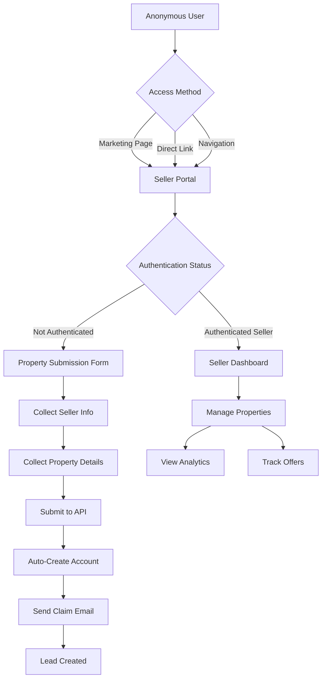
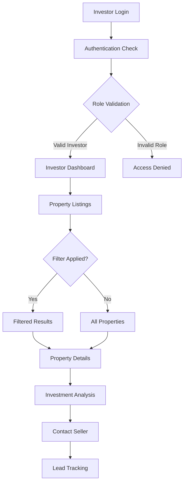
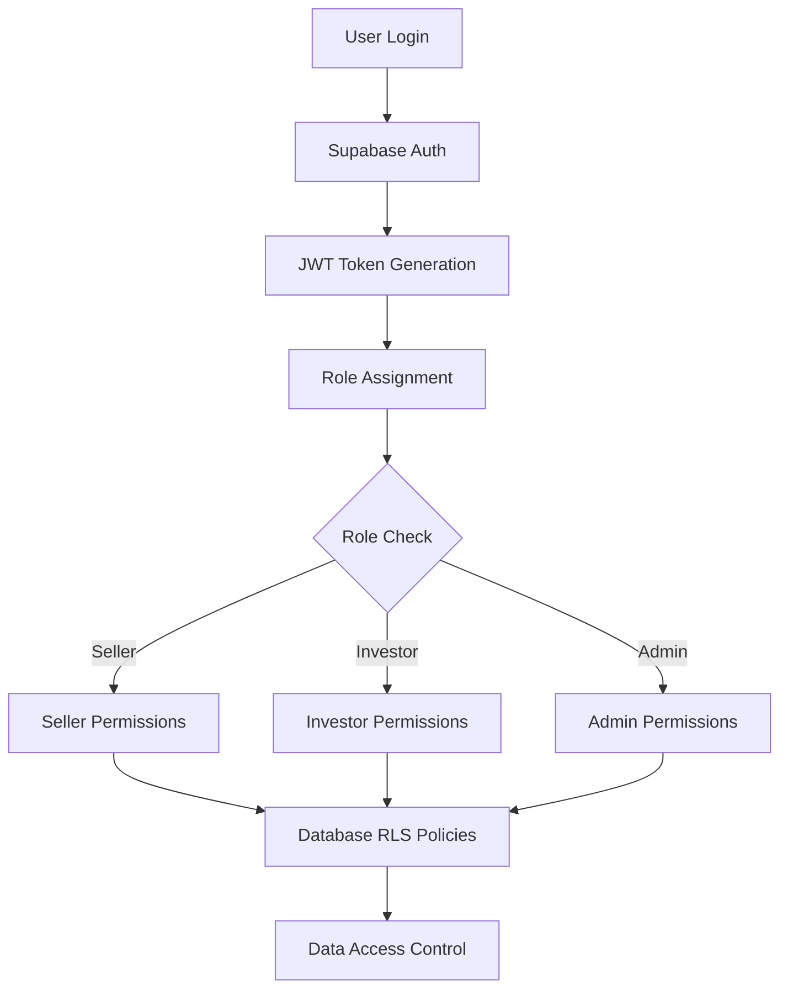
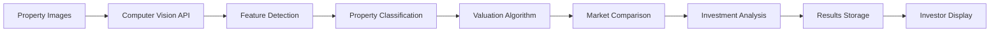

# QuicklyClose Platform - Requirements Documentation

## Table of Contents
1. [Executive Summary](#executive-summary)
2. [System Overview](#system-overview)
3. [User Personas & Scenarios](#user-personas--scenarios)
4. [Functional Requirements](#functional-requirements)
5. [Seller Portal Requirements](#seller-portal-requirements)
6. [Investor Portal Requirements](#investor-portal-requirements)
7. [Authentication & Authorization](#authentication--authorization)
8. [AI Integration Requirements](#ai-integration-requirements)
9. [Data Models & API Requirements](#data-models--api-requirements)
10. [Technical Architecture](#technical-architecture)
11. [Security Requirements](#security-requirements)
12. [Performance Requirements](#performance-requirements)
13. [Integration Requirements](#integration-requirements)

---

## Executive Summary

QuicklyClose is an AI-powered real estate platform that streamlines the connection between property sellers seeking quick cash sales and real estate investors. The platform leverages advanced computer vision technology, automated property valuations, and comprehensive investment analysis to facilitate efficient real estate transactions.

### Key Value Propositions
- **For Sellers**: Quick property valuation, streamlined submission process, automated lead generation
- **For Investors**: AI-powered property analysis, comprehensive investment metrics, curated deal flow
- **For Platform**: Automated deal qualification, reduced transaction friction, scalable AI-driven insights

---

## System Overview

### Platform Architecture
```
┌─────────────────────────────────────────────────────────────────┐
│                    QuicklyClose Platform                        │
├─────────────────────────────────────────────────────────────────┤
│  Frontend (Next.js 14)    │  Backend APIs    │  AI Integration  │
│  - Seller Portal          │  - Authentication│  - Computer Vision│
│  - Investor Portal        │  - Properties    │  - MCP Servers   │
│  - Admin Dashboard        │  - Leads         │  - Valuations    │
│  - Auth System           │  - Analysis      │  - Market Data   │
├─────────────────────────────────────────────────────────────────┤
│                    Database (PostgreSQL)                        │
│  - User Profiles     - Properties      - Leads                 │
│  - Analyses         - RLS Policies     - Audit Logs           │
└─────────────────────────────────────────────────────────────────┘
```

### Core Technology Stack
- **Frontend**: Next.js 14, React 18, TypeScript, Tailwind CSS
- **Backend**: Next.js API Routes, Supabase PostgreSQL
- **Authentication**: Supabase Auth with JWT tokens
- **AI Integration**: Model Context Protocol (MCP) servers
- **Deployment**: Vercel with continuous deployment

---

## User Personas & Scenarios

### 👤 Primary Persona: Sarah - Property Seller
**Demographics**: 
- Age: 35-55
- Homeowner needing quick sale
- Limited real estate knowledge
- Time-sensitive situation

**Goals**:
- Get accurate property valuation quickly
- Avoid traditional listing process
- Receive multiple cash offers
- Close transaction fast

**Pain Points**:
- Uncertain about property value
- Complex traditional selling process
- Need for quick turnaround
- Lack of investor connections

**User Journey**:
```
📱 Discovers Platform → 📝 Submits Property → 🔍 Gets Analysis → 💰 Receives Offers → ✅ Closes Deal
```

### 👤 Primary Persona: Mike - Real Estate Investor
**Demographics**:
- Age: 28-45
- Experienced real estate investor
- Technology-savvy
- Seeking deal flow efficiency

**Goals**:
- Find undervalued properties
- Get comprehensive investment analysis
- Access pre-qualified deals
- Scale investment portfolio

**Pain Points**:
- Time spent on analysis
- Finding quality deals
- Competition with other investors
- Market research complexity

**User Journey**:
```
🔍 Browse Properties → 📊 Review Analysis → 📞 Contact Seller → 🤝 Negotiate Deal → 💵 Close Transaction
```

### 👤 Secondary Persona: Alex - Platform Administrator
**Demographics**:
- Real estate and technology background
- Responsible for platform operations
- Quality control and user support

**Goals**:
- Maintain platform quality
- Optimize AI analysis accuracy
- Support user success
- Monitor platform performance

---

## Functional Requirements

### FR-001: User Registration & Authentication
**Priority**: Critical
**Description**: Users must be able to register and authenticate with role-based access

**Acceptance Criteria**:
- Users can register as Seller, Investor, or Admin
- Email verification required for account activation
- Role-based dashboard redirection after login
- Secure password reset functionality
- Account profile management capabilities

### FR-002: Property Submission System
**Priority**: Critical
**Description**: Sellers must be able to submit property information for analysis

**Acceptance Criteria**:
- Multi-step property submission form
- Support for anonymous submissions with automatic account creation
- Property image upload capability (up to 10 images)
- Address validation and geocoding
- Automatic lead generation upon submission

### FR-003: AI Property Analysis
**Priority**: Critical
**Description**: System must provide AI-powered property analysis and valuation

**Acceptance Criteria**:
- Computer vision analysis of property images
- Automated property valuation with confidence scoring
- Investment analysis for both flip and rental strategies
- Comparative market analysis (CMA) generation
- Feature detection and property scoring

### FR-004: Investment Portal
**Priority**: Critical
**Description**: Investors must have access to analyzed properties with comprehensive metrics

**Acceptance Criteria**:
- Property browsing with filtering capabilities
- Detailed investment analysis display
- Contact seller functionality
- Property favorites/watchlist
- Investment calculator tools

---

## Seller Portal Requirements

### 🏠 Seller Registration Flow



### SP-001: Anonymous Property Submission
**Priority**: Critical
**Requirement**: Allow anonymous users to submit properties without pre-registration

**Implementation**:
- Public access to seller portal (no role protection)
- Two-step form: seller information + property details
- Automatic user account creation with temporary password
- Email notification with account claim link
- Lead generation in system upon submission

**Data Collected**:
```typescript
interface SellerSubmission {
  // Seller Information
  name: string;
  email: string;
  phone: string;
  
  // Property Information
  address: string;
  city: string;
  state: string;
  zip: string;
  bedrooms: number;
  bathrooms: number;
  sqft: number;
}
```

### SP-002: Authenticated Seller Dashboard
**Priority**: High
**Requirement**: Provide comprehensive dashboard for registered sellers

**Features**:
- **Property Management**: View all submitted properties
- **Status Tracking**: Track property analysis status
- **Offer Management**: View and manage investor offers
- **Communication Hub**: Message system with interested investors
- **Analytics Dashboard**: Property performance metrics

**Property Status States**:
- `new` - Recently submitted, awaiting review
- `under_review` - Being analyzed by AI system
- `active` - Available to investors with completed analysis
- `in_negotiation` - Investor discussions ongoing
- `pending` - Sale agreement reached, awaiting closing
- `sold` - Transaction completed
- `expired` - Listing expired or withdrawn

### SP-003: Property Details Management
**Priority**: Medium
**Requirement**: Allow sellers to update and enhance property information

**Capabilities**:
- Edit property descriptions and features
- Upload additional property images
- Update contact preferences
- Add property availability timeline
- Set minimum acceptable offer

---

## Investor Portal Requirements

### 💼 Investor Access Flow



### IP-001: Property Discovery & Filtering
**Priority**: Critical
**Requirement**: Investors must be able to discover and filter properties efficiently

**Filter Categories**:
- **Price Range**: Under $100K, $100K-$250K, $250K-$500K, $500K+
- **Investment Type**: Fix & Flip, Buy & Hold Rental, Both
- **Location**: City, State, Zip Code, Radius search
- **Property Type**: Single Family, Multi-Family, Commercial
- **Investment Metrics**: Min ROI, Max Days on Market, Cap Rate

**Display Options**:
- Grid view with property cards
- List view with detailed metrics
- Map view with property locations
- Comparison view for multiple properties

### IP-002: Comprehensive Property Analysis
**Priority**: Critical
**Requirement**: Provide detailed investment analysis for each property

**Analysis Components**:

#### 📊 Market Valuation
```typescript
interface MarketValuation {
  estimated_value: number;
  confidence_score: number; // 0-100
  price_per_sqft: number;
  market_analysis: {
    days_on_market_avg: number;
    recent_sales_count: number;
    market_trend: 'rising' | 'stable' | 'declining';
  };
}
```

#### 🔨 Fix & Flip Analysis
```typescript
interface FlipAnalysis {
  after_repair_value: number;
  estimated_repair_cost: number;
  renovation_grade: 'light' | 'moderate' | 'heavy';
  potential_profit: number;
  roi_percentage: number;
  timeline_months: number;
}
```

#### 🏠 Rental Property Analysis
```typescript
interface RentalAnalysis {
  market_rent_estimate: number;
  cap_rate: number;
  cash_on_cash_return: number;
  rent_to_price_ratio: number;
  vacancy_rate: number;
  monthly_cash_flow: number;
}
```

### IP-003: Demo Mode Integration
**Priority**: Medium
**Requirement**: Provide comprehensive demo data for platform evaluation

**Demo Features**:
- Toggle between live and demo data
- Comprehensive sample property portfolio
- Realistic investment scenarios
- Full feature demonstration
- No real data exposure in demo mode

**Sample Data Requirements**:
- Minimum 20 diverse property examples
- Various investment types and price ranges
- Different market conditions and analysis results
- Complete analysis data for all properties

### IP-004: Lead Generation & Contact Management
**Priority**: High
**Requirement**: Enable investors to contact sellers and track interactions

**Contact Flow**:
1. Investor expresses interest in property
2. System generates lead record
3. Seller receives notification
4. Communication facilitated through platform
5. Interaction tracking and follow-up management

**Lead Tracking**:
- Initial contact timestamp
- Communication method preference
- Response time tracking
- Conversation status updates
- Deal outcome recording

---

## Authentication & Authorization

### 🔐 Security Architecture



### AUTH-001: Role-Based Access Control (RBAC)
**Priority**: Critical
**Requirement**: Implement comprehensive role-based access control

**User Roles**:

#### 👤 Seller Role
**Permissions**:
- Access seller portal and dashboard
- Submit and manage own properties
- View own property analytics
- Communicate with interested investors
- Update profile and preferences

**Restrictions**:
- Cannot access investor portal
- Cannot view other sellers' data
- Cannot access admin functions

#### 💼 Investor Role  
**Permissions**:
- Access investor portal and property listings
- View comprehensive property analyses
- Contact property sellers
- Manage investment preferences
- Track leads and opportunities

**Restrictions**:
- Cannot submit properties as seller
- Cannot access admin functions
- Cannot view other investors' data

#### 🛡️ Admin Role
**Permissions**:
- Access all platform functions
- Manage computer vision analyses
- Monitor system performance
- User account management
- Platform configuration

**Email Whitelist**: Admin access restricted to specific email addresses

### AUTH-002: Database Security
**Priority**: Critical
**Requirement**: Implement row-level security (RLS) policies

**RLS Policies**:
```sql
-- Sellers can only access their own data
CREATE POLICY seller_policy ON seller_profiles 
  FOR ALL USING (auth.uid() = user_id);

-- Investors can only access their own profiles
CREATE POLICY investor_policy ON investor_profiles 
  FOR ALL USING (auth.uid() = user_id);

-- Properties visible to all authenticated users
CREATE POLICY property_read_policy ON properties 
  FOR SELECT USING (auth.role() = 'authenticated');

-- Admins have full access
CREATE POLICY admin_policy ON ALL TABLES 
  FOR ALL USING (auth.email() IN (admin_emails));
```

### AUTH-003: Account Creation & Management
**Priority**: High
**Requirement**: Automated account creation and profile management

**Account Creation Flow**:
1. **User Registration**: Manual signup with role selection
2. **Anonymous Submission**: Automatic account creation for sellers
3. **Profile Creation**: Triggered by database functions
4. **Email Verification**: Account activation via email
5. **Password Management**: Secure reset and change functionality

---

## AI Integration Requirements

### 🤖 Computer Vision Analysis System



### AI-001: Computer Vision Property Analysis
**Priority**: Critical
**Requirement**: Automated property analysis from uploaded images

**Analysis Capabilities**:
- **Feature Detection**: Identify property features, condition, and amenities
- **Quality Assessment**: Rate property condition and maintenance needs
- **Space Analysis**: Estimate room sizes and layout efficiency
- **Curb Appeal**: Assess exterior attractiveness and marketability

**Output Requirements**:
```typescript
interface CompVisionAnalysis {
  id: string;
  property_id: string;
  features: PropertyFeature[];
  condition_score: number; // 0-100
  curb_appeal_score: number; // 0-100
  estimated_repair_cost: number;
  confidence_level: number; // 0-100
  analysis_date: string;
}

interface PropertyFeature {
  name: string;
  confidence: number;
  impact_score: number;
  category: 'interior' | 'exterior' | 'structural' | 'amenity';
}
```

### AI-002: Market Valuation Engine
**Priority**: Critical
**Requirement**: AI-powered property valuation with confidence scoring

**Valuation Factors**:
- Recent comparable sales data
- Property condition and features
- Location and neighborhood analysis
- Market trends and timing
- Property improvement potential

**Accuracy Requirements**:
- Target accuracy: ±15% of actual market value
- Confidence scoring based on data availability
- Regular model retraining and validation
- Market-specific calibration

### AI-003: Investment Analysis Automation
**Priority**: High
**Requirement**: Automated investment scenario analysis

**Analysis Types**:

#### Fix & Flip Analysis
- After Repair Value (ARV) estimation
- Renovation cost assessment
- Timeline and holding cost calculation
- Market absorption rate analysis
- Profit margin and ROI calculation

#### Rental Property Analysis
- Market rent estimation
- Cap rate calculation
- Cash flow projections
- Appreciation potential
- Market rental demand analysis

### AI-004: MCP Server Integration
**Priority**: Medium
**Requirement**: Advanced AI capabilities through MCP servers

**MCP Servers Configuration**:

#### Memory Server
- **Purpose**: Knowledge graph and entity management
- **Usage**: Store property relationships and market intelligence
- **Benefits**: Enhanced analysis through accumulated data

#### Sequential Thinking Server
- **Purpose**: Complex reasoning and analysis chains
- **Usage**: Multi-step investment analysis
- **Benefits**: More sophisticated decision-making logic

#### Filesystem Server
- **Purpose**: File operations and content management
- **Usage**: Property document and image management
- **Benefits**: Automated file processing workflows

#### Puppeteer Server
- **Purpose**: Web automation and data gathering
- **Usage**: Real-time market data collection
- **Benefits**: Current market information integration

---

## Data Models & API Requirements

### 📊 Core Data Models

#### User Management
```typescript
interface User {
  id: string;
  email: string;
  role: 'seller' | 'investor' | 'admin';
  created_at: string;
  updated_at: string;
  user_metadata: {
    full_name: string;
    role: string;
  };
}

interface SellerProfile {
  id: string;
  user_id: string;
  full_name: string;
  email: string;
  phone?: string;
  preferred_communication: 'email' | 'phone' | 'both';
  marketing_consent: boolean;
  created_at: string;
  updated_at: string;
}

interface InvestorProfile {
  id: string;
  user_id: string;
  full_name: string;
  company_name?: string;
  investment_focus: string[];
  minimum_investment: number;
  maximum_investment: number;
  preferred_locations: string[];
  phone?: string;
  created_at: string;
  updated_at: string;
}
```

#### Property Management
```typescript
interface Property {
  id: string;
  seller_id: string;
  address: string;
  city: string;
  state: string;
  zip_code: string;
  bedrooms: number;
  bathrooms: number;
  square_feet: number;
  property_type: 'single_family' | 'multi_family' | 'commercial';
  status: 'new' | 'under_review' | 'active' | 'pending' | 'sold';
  estimated_value?: number;
  images: string[];
  description?: string;
  created_at: string;
  updated_at: string;
}

interface Lead {
  id: string;
  seller_id: string;
  property_id: string;
  investor_id?: string;
  status: 'new' | 'contacted' | 'qualified' | 'negotiating' | 'closed';
  lead_source: 'website' | 'referral' | 'marketing';
  contact_method: 'email' | 'phone';
  notes?: string;
  created_at: string;
  updated_at: string;
}
```

### 🔌 API Requirements

#### API-001: Standardized Response Format
**Priority**: Critical
**Requirement**: All API endpoints must return consistent response format

```typescript
interface APIResponse<T> {
  success: boolean;
  data?: T;
  message?: string;
  error?: string;
  timestamp: string;
}
```

#### API-002: Authentication Middleware
**Priority**: Critical
**Requirement**: All API routes require authentication except public endpoints

**Implementation**:
```typescript
async function requireAuth(request: NextRequest) {
  const user = await getAuthenticatedUser(request);
  if (!user) {
    throw new Error('Authentication required');
  }
  return user;
}
```

#### API-003: Core API Endpoints

**Property Management**
- `GET /api/properties` - Retrieve properties with filtering
- `POST /api/properties` - Create new property (admin only)
- `PUT /api/properties/{id}` - Update property details
- `DELETE /api/properties/{id}` - Remove property

**Lead Management**
- `GET /api/leads` - Retrieve leads (role-based access)
- `POST /api/leads` - Create new lead
- `PUT /api/leads/{id}` - Update lead status
- `POST /api/sellers/leads` - Anonymous seller submission

**Analysis System**
- `POST /api/comp-vision/analyze` - Trigger property analysis
- `GET /api/comp-vision/analyses` - Retrieve analysis results
- `GET /api/comp-vision/analyses/{id}` - Get specific analysis

**System Health**
- `GET /api/health` - System status check

---

## Technical Architecture

### 🏗️ System Architecture Overview

```
┌─────────────────────────────────────────────────────────────┐
│                    Frontend Layer                           │
│  ┌─────────────┐  ┌─────────────┐  ┌─────────────┐        │
│  │   Seller    │  │  Investor   │  │    Admin    │        │
│  │   Portal    │  │   Portal    │  │  Dashboard  │        │
│  └─────────────┘  └─────────────┘  └─────────────┘        │
└─────────────────────────────────────────────────────────────┘
                              │
┌─────────────────────────────────────────────────────────────┐
│                  Application Layer                          │
│  ┌─────────────┐  ┌─────────────┐  ┌─────────────┐        │
│  │    Auth     │  │    API      │  │   Business  │        │
│  │   System    │  │   Routes    │  │    Logic    │        │
│  └─────────────┘  └─────────────┘  └─────────────┘        │
└─────────────────────────────────────────────────────────────┘
                              │
┌─────────────────────────────────────────────────────────────┐
│                    AI Integration Layer                     │
│  ┌─────────────┐  ┌─────────────┐  ┌─────────────┐        │
│  │ Computer    │  │     MCP     │  │  Analysis   │        │
│  │  Vision     │  │   Servers   │  │   Engine    │        │
│  └─────────────┘  └─────────────┘  └─────────────┘        │
└─────────────────────────────────────────────────────────────┘
                              │
┌─────────────────────────────────────────────────────────────┐
│                     Data Layer                              │
│  ┌─────────────┐  ┌─────────────┐  ┌─────────────┐        │
│  │ PostgreSQL  │  │   Supabase  │  │    File     │        │
│  │  Database   │  │    Auth     │  │   Storage   │        │
│  └─────────────┘  └─────────────┘  └─────────────┘        │
└─────────────────────────────────────────────────────────────┘
```

### TECH-001: Frontend Architecture
**Framework**: Next.js 14 with App Router
**Language**: TypeScript for type safety
**Styling**: Tailwind CSS with shadcn/ui components
**State Management**: Zustand + React Context

**Component Architecture**:
- **Pages**: Route-level components using App Router
- **Features**: Business logic components (SellerPortal, InvestorPortal)
- **UI**: Reusable interface components (shadcn/ui)
- **Providers**: Context providers for global state

### TECH-002: Backend Architecture
**API Layer**: Next.js API routes
**Database**: PostgreSQL via Supabase
**Authentication**: Supabase Auth with JWT
**File Storage**: Supabase Storage

**API Design Patterns**:
- RESTful endpoint design
- Standardized response format
- Comprehensive error handling
- Authentication middleware
- Role-based access control

### TECH-003: Database Design
**Primary Database**: PostgreSQL with Supabase
**Security**: Row Level Security (RLS) policies
**Performance**: Indexed queries for role-based access
**Reliability**: Automatic backups and replication

**Database Schema**:
```sql
-- User Profiles
CREATE TABLE seller_profiles (
  id UUID PRIMARY KEY DEFAULT gen_random_uuid(),
  user_id UUID REFERENCES auth.users(id),
  full_name TEXT NOT NULL,
  email TEXT UNIQUE NOT NULL,
  phone TEXT,
  preferred_communication TEXT DEFAULT 'email',
  marketing_consent BOOLEAN DEFAULT false,
  created_at TIMESTAMP DEFAULT NOW(),
  updated_at TIMESTAMP DEFAULT NOW()
);

CREATE TABLE investor_profiles (
  id UUID PRIMARY KEY DEFAULT gen_random_uuid(),
  user_id UUID REFERENCES auth.users(id),
  full_name TEXT NOT NULL,
  company_name TEXT,
  investment_focus TEXT[],
  minimum_investment INTEGER DEFAULT 0,
  maximum_investment INTEGER DEFAULT 0,
  preferred_locations TEXT[],
  phone TEXT,
  created_at TIMESTAMP DEFAULT NOW(),
  updated_at TIMESTAMP DEFAULT NOW()
);

-- Property Management
CREATE TABLE properties (
  id UUID PRIMARY KEY DEFAULT gen_random_uuid(),
  seller_id UUID REFERENCES seller_profiles(id),
  address TEXT NOT NULL,
  city TEXT NOT NULL,
  state TEXT NOT NULL,
  zip_code TEXT NOT NULL,
  bedrooms INTEGER NOT NULL,
  bathrooms INTEGER NOT NULL,
  square_feet INTEGER NOT NULL,
  property_type TEXT DEFAULT 'single_family',
  status TEXT DEFAULT 'new',
  estimated_value INTEGER,
  images TEXT[],
  description TEXT,
  created_at TIMESTAMP DEFAULT NOW(),
  updated_at TIMESTAMP DEFAULT NOW()
);

-- Lead Tracking
CREATE TABLE leads (
  id UUID PRIMARY KEY DEFAULT gen_random_uuid(),
  seller_id UUID REFERENCES seller_profiles(id),
  property_id UUID REFERENCES properties(id),
  investor_id UUID REFERENCES investor_profiles(id),
  status TEXT DEFAULT 'new',
  lead_source TEXT DEFAULT 'website',
  contact_method TEXT DEFAULT 'email',
  notes TEXT,
  created_at TIMESTAMP DEFAULT NOW(),
  updated_at TIMESTAMP DEFAULT NOW()
);
```

---

## Security Requirements

### 🔒 Security Architecture

### SEC-001: Authentication Security
**Priority**: Critical
**Requirements**:
- Secure password storage with hashing
- JWT token-based authentication
- Session management and timeout
- Multi-factor authentication support
- Account lockout protection

### SEC-002: Data Protection
**Priority**: Critical
**Requirements**:
- Database encryption at rest
- Secure data transmission (HTTPS/TLS)
- Row-level security policies
- Personal data anonymization
- GDPR compliance measures

### SEC-003: Input Validation & Sanitization
**Priority**: High
**Requirements**:
- Server-side input validation
- SQL injection prevention
- XSS attack protection
- File upload security
- Rate limiting implementation

### SEC-004: Access Control
**Priority**: Critical
**Requirements**:
- Role-based access control (RBAC)
- Principle of least privilege
- Cross-role data isolation
- Admin access restrictions
- API endpoint protection

---

## Performance Requirements

### ⚡ Performance Benchmarks

### PERF-001: Application Performance
**Response Time Requirements**:
- Page load time: < 2 seconds
- API response time: < 500ms
- Image upload: < 5 seconds
- Search results: < 1 second

**Scalability Requirements**:
- Concurrent users: 1,000+
- Database queries: < 100ms
- File storage: 10GB+
- CDN delivery: Global

### PERF-002: AI Processing Performance
**Analysis Speed Requirements**:
- Computer vision analysis: < 30 seconds
- Property valuation: < 10 seconds
- Market comparison: < 5 seconds
- Batch processing: 100+ properties/hour

---

## Integration Requirements

### 🔗 External Integrations

### INT-001: MCP Server Integration
**Priority**: Medium
**Requirements**:
- Five MCP servers configured and operational
- Server health monitoring and status dashboard
- Failover and error handling
- Performance monitoring and optimization

### INT-002: Email Integration
**Priority**: High
**Requirements**:
- Transactional email service (Supabase/SendGrid)
- Account verification emails
- Password reset notifications
- Lead notification system
- Marketing email support (with consent)

### INT-003: File Storage Integration
**Priority**: High
**Requirements**:
- Image upload and storage (Supabase Storage)
- Image optimization and compression
- Secure file access controls
- CDN delivery for performance
- File backup and recovery

---

## Testing Requirements

### 🧪 Testing Strategy

### TEST-001: Automated Testing
**Priority**: High
**Requirements**:
- Unit tests for all components (Jest + React Testing Library)
- API endpoint testing with authentication
- Integration tests for user workflows
- End-to-end testing for critical paths
- Performance testing and load testing

**Testing Coverage**:
- Code coverage: > 80%
- Critical path coverage: 100%
- API endpoint coverage: 100%
- User workflow coverage: 100%

### TEST-002: Quality Assurance
**Priority**: High
**Requirements**:
- Cross-browser compatibility testing
- Mobile responsiveness testing
- Accessibility compliance (WCAG 2.1)
- Security vulnerability scanning
- Performance benchmarking

---

## Deployment & DevOps Requirements

### 🚀 Deployment Strategy

### DEPLOY-001: Continuous Deployment
**Platform**: Vercel
**Requirements**:
- Automated deployment from Git
- Environment-based configurations
- Database migration management
- Feature flag support
- Rollback capabilities

### DEPLOY-002: Monitoring & Observability
**Requirements**:
- Application performance monitoring
- Error tracking and alerting
- User analytics and behavior tracking
- System health monitoring
- Log aggregation and analysis

---

## Compliance & Legal Requirements

### ⚖️ Regulatory Compliance

### LEGAL-001: Data Privacy
**Requirements**:
- GDPR compliance for EU users
- CCPA compliance for California users
- Privacy policy and terms of service
- User consent management
- Data deletion and portability

### LEGAL-002: Real Estate Compliance
**Requirements**:
- Fair Housing Act compliance
- State-specific real estate regulations
- Lead-based paint disclosure (where applicable)
- Property condition disclaimers
- Investment advice disclaimers

---

## Future Enhancements

### 🔮 Roadmap Items

### FUTURE-001: Advanced Features
- Mobile application (iOS/Android)
- Advanced investment calculators
- Market trend analysis and reporting
- Automated offer generation
- CRM integration for agents

### FUTURE-002: AI Enhancements
- Predictive market analysis
- Natural language property descriptions
- Virtual property tours
- Market timing recommendations
- Investment portfolio optimization

---

## Appendix

### A. Glossary of Terms
- **ARV**: After Repair Value - estimated property value after renovations
- **Cap Rate**: Capitalization rate - measure of rental property profitability
- **CMA**: Comparative Market Analysis - property valuation method
- **MCP**: Model Context Protocol - AI integration framework
- **RLS**: Row Level Security - database security feature

### B. Reference Documents
- Next.js 14 Documentation
- Supabase Documentation
- MCP Server Protocols
- shadcn/ui Component Library
- Tailwind CSS Framework

### C. Contact Information
- **Technical Lead**: [Contact Information]
- **Product Manager**: [Contact Information]
- **Security Officer**: [Contact Information]

---

*Document Version: 1.0*  
*Last Updated: [Current Date]*  
*Document Owner: QuicklyClose Development Team*